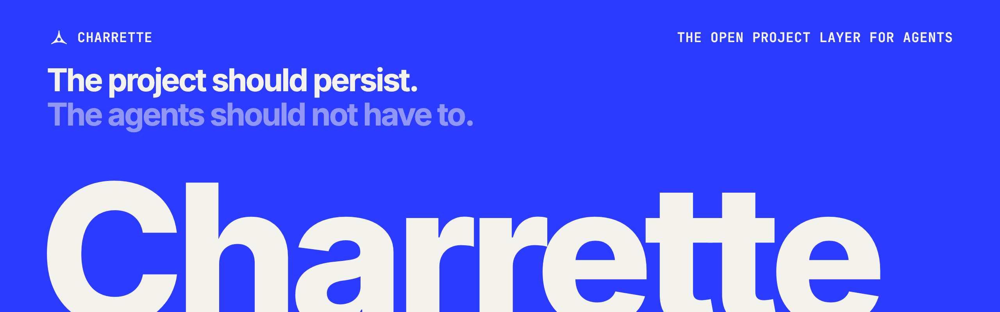

Charrette is an open-source environment for running software projects with AI coding agents. It keeps the project in one place: its rules, knowledge, decisions, tasks and history. That place outlasts any single agent session. The work goes to whichever agents suit it, such as Claude Code, Codex or Gemini CLI, as installed on your machine.

> [!NOTE]
> **Very early.** There is no runnable Charrette yet. This repository holds the thesis, the architecture, the interface primitives and the brief. The model, and the words for it, will change as we prototype.

## Why

Today, the useful context from AI-assisted work collects inside individual agent sessions, one developer's chat history, and whichever tool or model was in use at the time. Change the model, the tool or the person, and much of it is lost.

Charrette makes the **project** the thing that persists. Agents come and go. They start from what the project knows and leave behind what they learned.

## How it works

| | |
| --- | --- |
| **Project** | A body of work with its own rules, knowledge and history. It owns everything below, and it may span several repositories or none. |
| **Coordinator** | The project's agent that you talk to. It plans and orders tasks, hands them out, answers questions and follows the work. It never writes code itself. |
| **Task** | One piece of work with an outcome, usually one change. |
| **Lead** | The agent that owns a task. It implements, runs the task's steps, such as review and verify, and settles what they find. Each step can use a different model. |
| **Knowledge** | What the project holds: notes that every task starts with (decisions, conventions, architecture), and what individual tasks noticed along the way. |
| **Artifacts** | What a task produced that is worth keeping but doesn't belong in a repository. |

Agents work under the project's rules. You're pulled in only when something needs a person to decide.

## Open by design

Model providers will build good orchestration around their own agents. Developers have a different incentive: to use whichever agent is best for the work. If a project's knowledge, workflows and history become some of the most valuable parts of how a team builds software, that layer shouldn't belong to one provider.

Charrette aims to let you:

- mix agents from different providers in one project, and switch between them mid-task
- keep project data portable and inspectable
- see and change how orchestration works
- keep what the project has learned when a better model or tool appears

## The thesis

Charrette tests a broader hypothesis about how software engineering changes once coding agents are abundant. The argument, the questions it raises and the evidence we hope to collect are in **[THESIS.md](./THESIS.md)**. Treat Charrette as an experiment that comes out of that thesis, not as proof of it.

## In this repository

| Path | What's there |
| --- | --- |
| [`THESIS.md`](./THESIS.md) | The research hypothesis |
| [`ARCHITECTURE_PLAN.md`](./ARCHITECTURE_PLAN.md) | The working architecture: a local-first desktop app, with seams for a later cloud |
| [`docs/architecture/`](./docs/architecture) | The plan in depth, listed below |
| [`ARCHITECTURE.md`](./ARCHITECTURE.md) | The engineering standards every app and package follows |
| [`packages/ui`](./packages/ui) | `@charrette/ui`, the interface primitives, with a Storybook and a workbench |
| [`apps/pitch`](./apps/pitch) | The brief and research note, as a static site |

The architecture in depth:

1. [Concepts and the project model](./docs/architecture/01-concepts-and-project-model.md)
2. [Desktop runtime](./docs/architecture/02-desktop-runtime.md)
3. [Agent runtime and auth](./docs/architecture/03-agent-runtime-and-auth.md)
4. [Workflow engine](./docs/architecture/04-workflow-engine.md)
5. [Integrations and skills](./docs/architecture/05-integrations-and-skills.md)
6. [Persistence, security and cloud](./docs/architecture/06-persistence-security-and-cloud.md)
7. [Precedents and validation](./docs/architecture/07-precedents-and-validation.md)

## Develop

You need Bun 1.3.5 and Node 24. The pinned versions are in `.bun-version` and `.node-version`.

```bash
bun install --frozen-lockfile
bun run dev                            # the pitch site, at localhost:5290
bun --filter @charrette/ui storybook   # the UI package's Storybook, at localhost:6006
bun run verify                         # checks, tests and builds for every package
```

Each app and package has its own README or `ARCHITECTURE.md` with more detail.

## Licence

Charrette is meant to be open source, but no licence has been chosen yet. Until one is added, all rights are reserved.
