<h1 align="center">Every coding agent. One crew. No babysitting.</h1>

<p align="center">
  Althar runs Claude Code, Codex and OpenCode as one team, on the plans you already pay for.<br />
  A coordinator plans the work, one agent builds it, another reviews it, and when one runs out the next takes over.<br />
  <b>You come back to pull requests, not prompts.</b>
</p>

<p align="center">
  <a href="https://github.com/AltharIDE/althar/releases/latest"><b>Download</b></a> ·
  <a href="https://althar.ai"><b>Website</b></a> ·
  <a href="#get-started"><b>Get started</b></a> ·
  <a href="#how-it-works"><b>How it works</b></a> ·
  <a href="CONTRIBUTING.md"><b>Contributing</b></a>
</p>

<p align="center">
  Free and open source · Apache 2.0 · macOS, Windows and Linux
</p>

<br />

<h3 align="center">The most beautiful IDE ever built, at your fingertips.</h3>

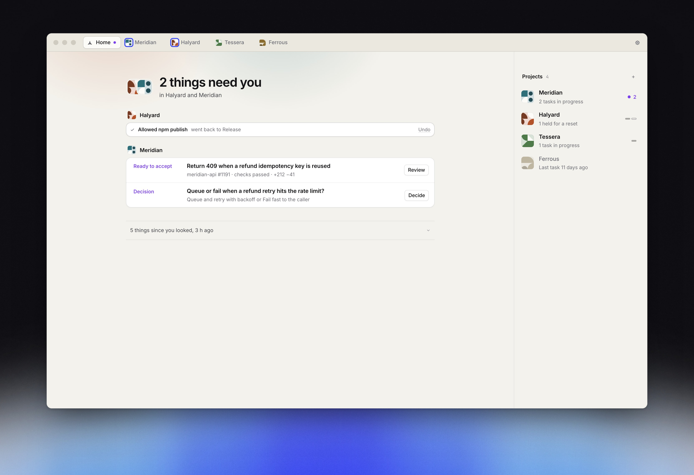

## Why Althar

The best coding agent right now is Claude Code. Or Codex. Or an open model. Ask again next month. New models ship most weeks, open models keep closing the gap, and prices and limits move with all of it. And when you swap, all your chats, your context, your integrations, lost.

The industry pace rewards optionality. The tools we use punish it.

Meet Althar:

- **Everything stays on your computer.** Projects, threads and history live in a local database on your machine. No Althar account, no Althar cloud, nothing of ours between you and the model.
- **Open source, for real.** Apache 2.0. Read every line, fork it, run it. If we disappear, your setup doesn't.
- **Every plan, every account.** Claude, ChatGPT and your API keys, side by side, with as many accounts on each as you have. Yes, we know, the second account is worth it. Althar uses them all.
- **Runs out? It swaps.** When an account hits its limit, the work moves to the next account or agent with room: same thread, same plan, same branch. No more waiting for a reset.
- **Reviews, baked in.** Ever felt like a meat proxy, pasting one agent's answer into another and typing "review this"? Every task is reviewed by another model, and the lead fixes what it finds before you see it.
- **Works with your tools.** GitHub, GitLab, Bitbucket, Linear, Jira and Trello. Issues in, pull requests out, named the way your team names them.

Subscriptions come and go. Your projects stay. Althar, stays.

## What it does

<table>
  <tr>
    <td width="44%" valign="top">
      <h3>No new account. No new bill.</h3>
      <p>Althar uses the sign-ins already on your machine: your Claude plan, your ChatGPT plan, your keys. No token reselling, no proxy, nothing of ours between you and the model.</p>
      <p>Add several accounts per agent, and pick any agent's model and effort from one picker. New agents join through the <a href="https://agentclientprotocol.com">Agent Client Protocol</a>: an adapter, not a rewrite.</p>
    </td>
    <td width="56%" valign="top">
      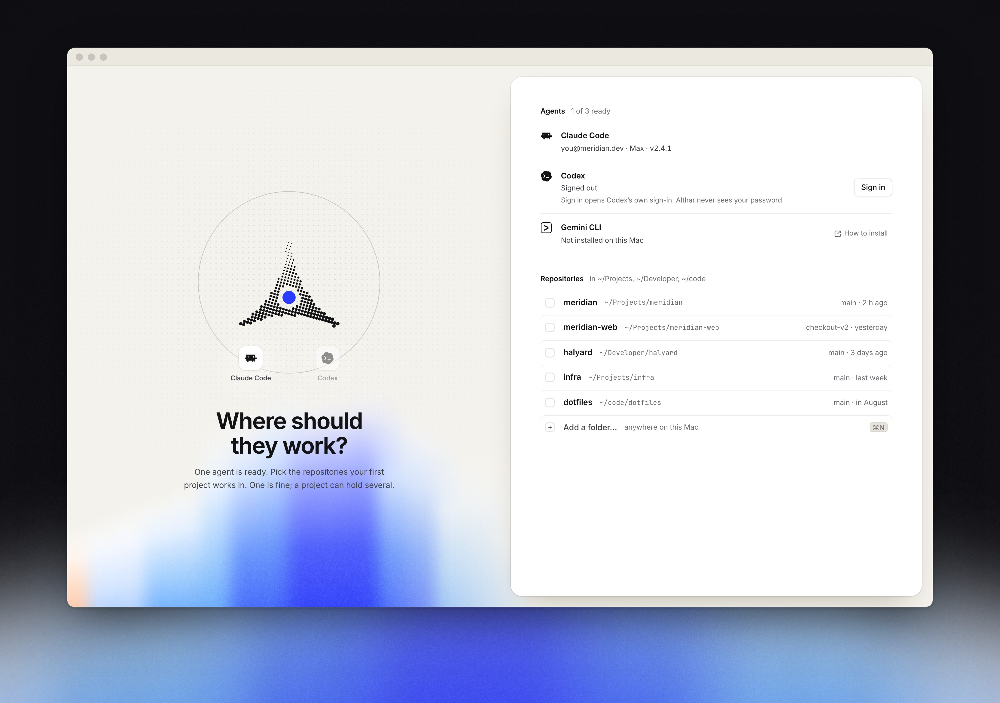
    </td>
  </tr>
  <tr>
    <td valign="top">
      <h3>Tell it what. It picks the team.</h3>
      <p>Each project has a coordinator. Ask it about the code, or say what you want changed. It reads the repositories and your rules, turns the ask into a task, and proposes who does each step.</p>
      <p>Change anyone, or hold it. Leave it alone and it starts. Tasks run side by side, each in a worktree of its own.</p>
    </td>
    <td valign="top">
      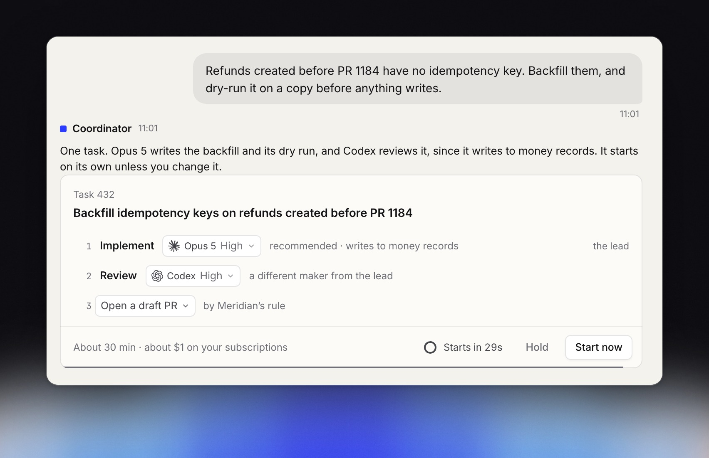
    </td>
  </tr>
  <tr>
    <td valign="top">
      <h3>Implement. Review. Fix. Review again.</h3>
      <p>Tasks don't stop at a first draft. By default a model from another maker reviews the lead's work. The lead fixes each finding or sets it aside with its reason, and review goes round again until it's clean.</p>
      <p>Then the task opens a pull request with your team's branch name, title and template, or merges locally. You only step in to merge.</p>
    </td>
    <td valign="top">
      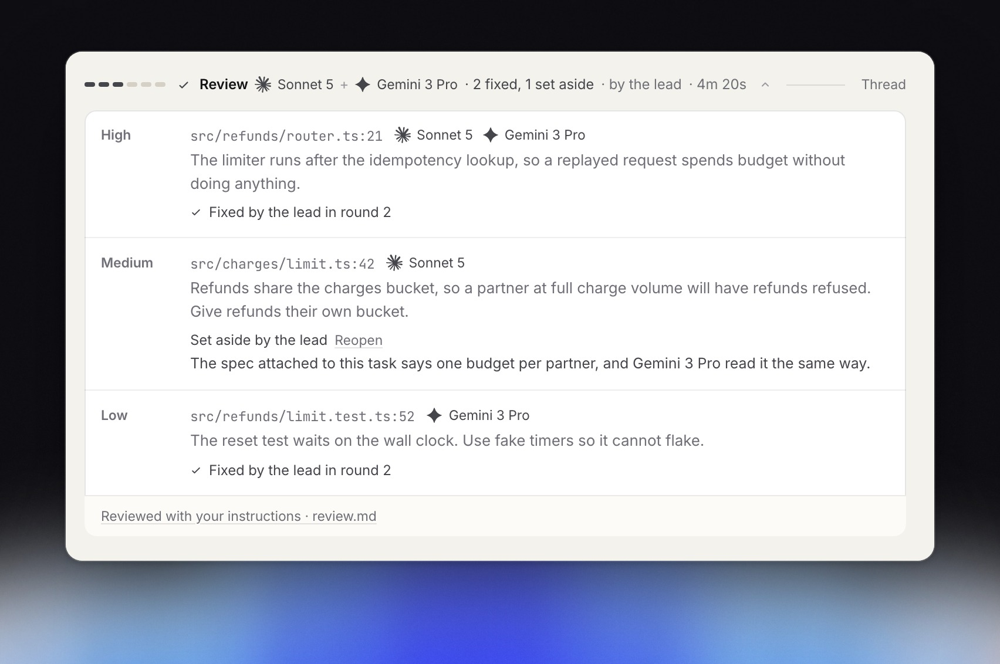
    </td>
  </tr>
  <tr>
    <td valign="top">
      <h3>It keeps going while you're away.</h3>
      <p>An agent hits its limit: the work moves to the next one with room, or waits for the reset. A turn goes quiet: it's carried on, then started afresh, then brought to you.</p>
      <p>Every task sits on a board by lane, and you hear about it only when something needs a person.</p>
    </td>
    <td valign="top">
      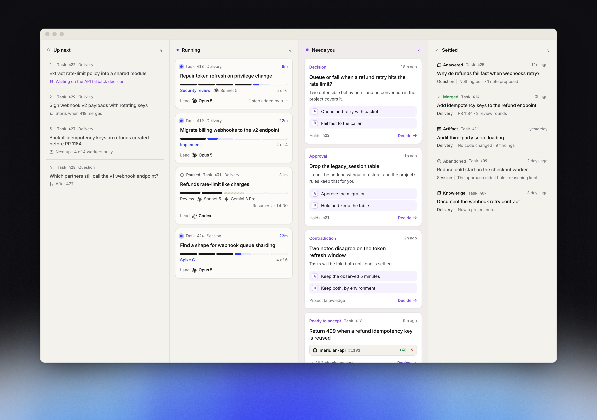
    </td>
  </tr>
  <tr>
    <td valign="top">
      <h3>Stays with you. Out of the way.</h3>
      <p>On a Mac, Althar hangs round the notch, or sits in the menu bar. At rest it's a sliver with a count of what needs you. Point at it and it drops open: allow a command or open a change without leaving what you're in.</p>
      <p>It never pings you for progress. Only for a call that's yours.</p>
    </td>
    <td valign="top">
      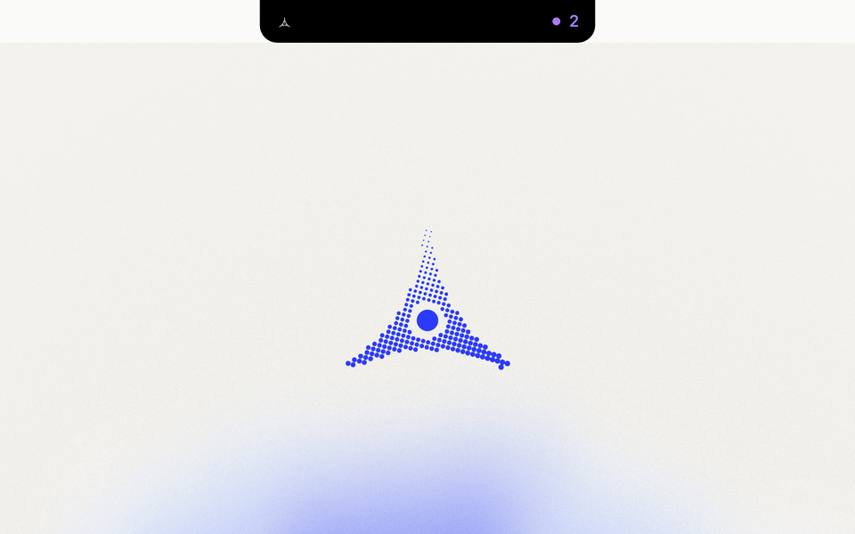
    </td>
  </tr>
  <tr>
    <td valign="top">
      <h3>Made with care.</h3>
      <p>The window opens in its own light. Every agent and every account sits in one place. You pick the icon your Dock wears. And when nothing needs you, it says so and gets out of the way.</p>
      <p>Small things, done properly, because you'll spend your day in it.</p>
    </td>
    <td valign="top">
      
    </td>
  </tr>
</table>

### And the rest

- **Projects** of one repository, several, or a folder inside one, in tabs across the top, with a home across all of them.
- **Talk to any lead, any time.** Interrupt it, queue a message for its next turn, change its model, or hand the task to another agent.
- **Changes file by file** before you accept them. Push stays yours.
- **Code hosts and trackers:** GitHub, GitLab and Bitbucket for pull requests; Linear, Jira, Trello and GitHub issues for work coming in.
- **Never miss a call.** A notification when something needs you, and a count on the Dock.
- **Dictation that stays on your computer.** After a one-time model download, nothing you say leaves it.

## How it works

<table>
  <tr>
    <td width="150" align="center">
      <picture>
        <source media="(prefers-color-scheme: dark)" srcset="brand/export/crew/project-dark.svg" />
        
      </picture>
    </td>
    <td>
      <b>Project</b><br />
      One or more repositories you open in Althar, with their own rules, tasks and history. It's the thing that lasts.
    </td>
  </tr>
  <tr>
    <td align="center">
      <picture>
        <source media="(prefers-color-scheme: dark)" srcset="brand/export/crew/coordinator-dark.svg" />
        
      </picture>
    </td>
    <td>
      <b>Coordinator</b><br />
      The project's agent that you talk to. It answers questions, plans tasks and hands them out. It never writes code itself.
    </td>
  </tr>
  <tr>
    <td align="center">
      <picture>
        <source media="(prefers-color-scheme: dark)" srcset="brand/export/crew/task-dark.svg" />
        
      </picture>
    </td>
    <td>
      <b>Task</b><br />
      One piece of work with an outcome, usually one change, growing in a worktree of its own.
    </td>
  </tr>
  <tr>
    <td align="center">
      <picture>
        <source media="(prefers-color-scheme: dark)" srcset="brand/export/crew/lead-dark.svg" />
        
      </picture>
    </td>
    <td>
      <b>Lead</b><br />
      The agent that owns a task. It implements, then settles what review finds: fixes it, or sets it aside with a reason.
    </td>
  </tr>
  <tr>
    <td align="center">
      <picture>
        <source media="(prefers-color-scheme: dark)" srcset="brand/export/crew/step-dark.svg" />
        
      </picture>
    </td>
    <td>
      <b>Step</b><br />
      Part of a task, today implement and review. Each step can run on a different agent and model, and reports back to the lead.
    </td>
  </tr>
</table>

Everything runs on your machine. The project's tasks, threads and history are kept in a local database you can read.

## Your agents

<table>
  <tr>
    <td width="25%" align="center" valign="top">
      <picture>
        <source media="(prefers-color-scheme: dark)" srcset=".github/readme/agents/claude-code-dark.svg" />
        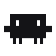
      </picture><br />
      <b>Claude Code</b><br />
      Claude Pro or Max, or an API key
    </td>
    <td width="25%" align="center" valign="top">
      <picture>
        <source media="(prefers-color-scheme: dark)" srcset=".github/readme/agents/codex-dark.svg" />
        
      </picture><br />
      <b>Codex</b><br />
      ChatGPT Plus, Pro or Business, or an API key
    </td>
    <td width="25%" align="center" valign="top">
      <picture>
        <source media="(prefers-color-scheme: dark)" srcset=".github/readme/agents/opencode-dark.svg" />
        
      </picture><br />
      <b>OpenCode</b><br />
      Any API key, or a local model
    </td>
    <td width="25%" align="center" valign="top">
      <picture>
        <source media="(prefers-color-scheme: dark)" srcset=".github/readme/agents/on-the-way-dark.svg" />
        
      </picture><br />
      <b>Many more on the way</b><br />
      Any agent that speaks the <a href="https://agentclientprotocol.com">Agent Client Protocol</a> can join
    </td>
  </tr>
</table>

## Get started

> [!NOTE]
> **Early.** Althar runs on macOS, Windows and Linux, and is tested most on macOS. Things will change, and some will break. [Tell us when they do](https://github.com/AltharIDE/althar/issues).

Sign in each agent you want to use with its own tool first:

```bash
claude auth login
```

```bash
codex login
```

```bash
opencode auth login
```

Then [download Althar](https://github.com/AltharIDE/althar/releases/latest) for your system, open it, and pick the repositories your first project works in. The first screen shows which agents are ready.

### From source

You need git, [Bun](https://bun.sh) 1.3.5 and Node 24.

```bash
git clone https://github.com/AltharIDE/althar.git && cd althar
```

```bash
bun install --frozen-lockfile
```

```bash
bun --filter @althar/desktop dev
```

That builds the app and opens it. [DEVELOPMENT.md](DEVELOPMENT.md) has the rest.

## The thesis

Althar comes out of a broader hypothesis: what happens to software engineering once coding agents are abundant, and the project, not the agent session, is the thing that lasts. The argument, the questions it raises and the evidence we hope to collect are in **[THESIS.md](THESIS.md)**.

## Learn more

| | |
| --- | --- |
| [Development](DEVELOPMENT.md) | Set up, run, test and change the code |
| [Engineering standards](ARCHITECTURE.md) | What every app and package in the repository holds to |
| [Architecture](docs/architecture/README.md) | How Althar is built: a local-first desktop app, with seams for a later cloud |
| [Decisions](docs/decisions) | What has been decided, and why |
| [Open questions](docs/open-questions.md) | What hasn't been decided yet |
| [Glossary](docs/glossary.md) | The words the interface uses |
| [Components](packages/ui) | The interface, piece by piece, with every state as a story |
| [Brand](brand) | The mark, lockups, banners, screenshots and the crew |

## Contributing

The most useful thing you can do right now is use Althar on real work and tell us what breaks, in [an issue](https://github.com/AltharIDE/althar/issues). To change the code, start with [CONTRIBUTING.md](CONTRIBUTING.md). Everyone taking part follows the [code of conduct](CODE_OF_CONDUCT.md). To report a security problem, see [SECURITY.md](SECURITY.md).

## Licence

Althar is open source under the [Apache License 2.0](LICENSE). See [NOTICE](NOTICE).

Claude, Codex, Gemini, OpenCode, GitHub, GitLab, Bitbucket, Linear, Jira and Trello are trademarks of their owners. Althar isn't affiliated with or endorsed by them.
