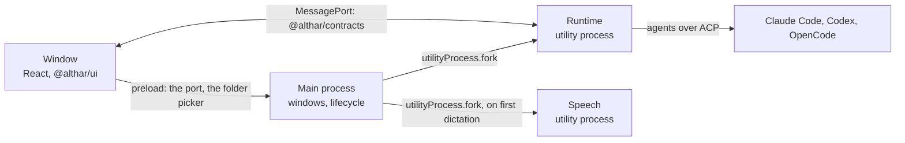

# @althar/desktop — Architecture

The desktop shell of [docs/architecture/02](../../docs/architecture/02-desktop-runtime.md). The repository's [ARCHITECTURE.md](../../ARCHITECTURE.md) sets the general engineering target.

- **Owner:** Repository maintainers
- **Consumers:** people using Althar.
- **Dependency direction:** the window depends on `@althar/ui` and `@althar/contracts`; the runtime's process on `@althar/runtime`. The window never imports the runtime, and the kit never imports Effect.

## Processes

| Where | What it holds | What it never holds |
| --- | --- | --- |
| `src/main` | Windows, the app's lifecycle, the runtime's process and its restarts, the folder picker and folder grants, the repositories found where people keep code for the first screen (`repositories.ts`), external links, notifications and the Dock's count, the app's own preferences (`appPreferences.ts`, kept in the profile's `desktop.json`), keeping the Mac awake while work runs, and dictation's microphone permission, the system's settings and the speech process | Projects, tasks, rules, sessions |
| `src/preload` | The bridge: hands the page its port, and asks main for grants for picked and dropped folders and for repositories it found, and carries dictation's calls | Node, the file system, a shell, paths |
| `src/speech` | Dictation's speech process (ADR-017): the pinned model, its checked and resumable download, and sherpa-onnx turning speech into text | Anything but speech |
| `src/runtime` | The runtime (`@althar/runtime`), serving the API over each window's port, and telling the main process what needs the person | Anything about windows |
| `src/renderer` | The window: views, view models and the data layer (ADR-010) | Effect outside `data/`; Node |

## How they talk

- **Main starts the runtime** in a utility process, with the profile and worktree folders in its environment. The runtime opens the store, reconciles what an earlier launch left, and waits for ports. If it crashes, main starts it again and reloads each window, which reconnects; reconciliation makes that safe, and each task it touched says "Althar restarted." More than three crashes in a minute end the app instead.
- **Each page load gets a fresh port.** On `did-finish-load`, main makes a `MessageChannelMain`, sends one end to the runtime and the other to the page through the preload. The runtime serves the API over it on a fiber of its own, until the window closes its client or the port goes.
- **The API is Effect RPC** (`@althar/contracts`): typed calls, typed errors (`ApiError`, in words), and one stream, `Watch`. Every message is checked against its schema on both sides.
- **Commands carry the window's own ids.** The client makes one per command and, when the runtime gave no answer (rather than said no), tries once more under the same id; the runtime answers the retry from the first one's receipt.
- **The window opens behind its launch.** The launch (the kit's `Launch`) plays at once while the window connects, reads the projects, the place it opens on and every open tab, then opens onto them, whole. A reload, as after the runtime restarted, opens with a fade instead.
- **The window watches once.** It watches the change feed from where its first read of the projects stood, for every screen (`data/feed.ts`), so nothing after that read is missed. A watch that breaks picks up from the last change it heard.
- **What changes reaches the window three ways.** `Changed` comes from the store's change feed, with the thread it belongs to: a task's screen reads a changed item alone, and anything else about the thread reads the thread's head without its items. `Streaming` carries an agent's message or thought as far as it has come, at most every 50 ms, with its kind and agent: the thread shows it from its first words, before it has read the item, and in place of the stored text until the store catches up. `Context` is how full the context of the agent on a thread is, as the agent says; the conversation's session keeps it.
- **A thread comes a page at a time:** the newest hundred items, and earlier pages when asked.
- **Folders come from main, as grants.** The folder picker and dropped folders go through main, which tells the runtime the folder and hands the window a grant; the window opens a project by its grant and never names a path (07). The repositories main finds for the first screen reach the window by an id and where each is, as the person knows the place; main grants one only by that id, once the person ticks it and makes the project.
- **Quitting asks the runtime to stop** every session and record it, and waits up to 20 seconds before the app goes.

## The window

MVVM in feature folders ([ADR-010](../../docs/decisions/010-desktop-app-mvvm.md)), under `src/renderer`:

| Folder | What it holds |
| --- | --- |
| `data/` | The client: Effect inside, plain promises and a subscription outside; the window's cache of what it read and its watch on the change feed ([ADR-014](../../docs/decisions/014-window-keeps-what-it-read.md)); opening the window; the services view models reach through React; the models each agent offers, read once for the window |
| `features/start` | Where the window starts: the first screen with no project yet, where the agents answer and the first project is made of the repositories found, added or dropped; a folder of several repositories opened from the home before it is a project; and the home once there are projects |
| `features/home` | The home: across projects, what waits on you, what runs and what the loop did since you left, with the projects beside it and the agents' marks in the bar |
| `features/settings` | The agents on this Mac with their accounts, the code hosts and trackers, keeping the Mac awake and the editor files open in, notifications, the app's icon and where Althar shows in another app |
| `features/project` | A project's menu (rename, its repositories, its rules, remove from Althar, each asked in a dialog first), on its bar and its tasks' bars. A project's window: the coordinator's thread with each task's card (its plan before it starts, then where it stands), the agent the coordinator runs on, and a task you plan yourself, beside it |
| `features/board` | A project's board: its lanes, what waits on you in it, and the dock the home used to open, now unused |
| `features/rules` | A project's rules (ADR-013): who answers, what always asks and what is never allowed, how a task ends, usage limits and accounts; each change saved at once |
| `features/repositories` | A project's repositories: adding a folder, leaving one out, each one's role, and where a fork's pull requests open; each change saved at once |
| `features/task` | A task's thread, the calls waiting on you, the composer, what it changed, and its menu in the bar: start its plan now, mark its draft pull requests ready, stop, resume, abandon (asked in a dialog first) and reopen, each only where the runtime says it applies |
| `shared/` | A thread's items as blocks, drawn with the kit (finished work folded, steps' results under it); the model picker every conversation and plan step uses; how agents and times are drawn; what a place shows while a slow read comes; dictation in a composer (`dictation/`: the view model, the recorder, the writing down as it is said, the project's names spelt as its code spells them, each system's words) |

Each feature holds its route (`route.tsx`, with what it reads before it shows), its view model (`use*.ts`), its view (`*View.tsx`) and its styles. `router.tsx` puts the routes together, with the place in the hash, since the page loads from a file.

## Principles

- **The kit draws; the app arranges.** Views compose `@althar/ui` and add layout and page margins, nothing that looks like a component of its own. When a view needs something the kit lacks, it goes into the kit, with its stories.
- **The runtime owns the state; the window keeps what it last said** ([ADR-014](../../docs/decisions/014-window-keeps-what-it-read.md)). View models read from the window's cache and hold what is streaming. A change reads again the whole reads it touches (the projects, the home, a board, the connections), on screen or not; a thread on screen reads what changed item by item, and one off screen is marked and read when next opened. Nothing goes out of date by age, and nothing is patched but a thread's items as they are read.
- **A screen opens whole.** Its route reads what it shows first, from the cache when nothing changed, and the screen being left stays until then. A read slower than 150 ms shows the place's outline, never a spinner, for at least 300 ms; what hasn't been read is never drawn as empty.
- **Each agent is asked again** once a launch, whenever the window comes back to the front, and as Settings opens. Everywhere else shows what the runtime last knew.
- **The page is locked down** (07's renderer list). Sandboxed, context-isolated, no Node, a strict Content Security Policy, no new windows and no navigation away, no web permissions granted but the microphone (audio alone, in Althar's own windows, for dictation), and no paths. Links open in the person's browser, for `https:` and local `http:` only.
- **Test hooks stay out of packaged builds.** `ALTHAR_FAKE_AGENTS` works only in a build made with `bun run build`; `bun run build:package` leaves the code out. It swaps in the fake agent, the connectors' fake GitHub, and secrets kept in memory, so the end-to-end tests never reach a network or the Keychain. `ALTHAR_FAKE_SPEECH` swaps in a speech model that comes down at once and hears the same words, with Chromium's fake microphone, which the system is never asked about (`ALTHAR_FAKE_MICROPHONE` for the microphone alone).
- **Dictation is local** ([ADR-017](../../docs/decisions/017-dictation-on-this-machine.md)). The first press offers the speech model in the composer's tray, and nothing comes down until the person says Download; the microphone is asked for first. What is said shows faint at the cursor as it is said, and is written there when it stops, with the project's names (`GetVocabulary`, read once a window) spelt as its code spells them; never sent. Escape while listening throws it away. ⌘⇧D starts and stops it; held, letting go stops it.
- **Words on screen follow [the glossary](../../docs/glossary.md).**
- **Every composer says how full its agent's context is,** with the kit's ring, from what the agent last said while it runs; nothing where it hasn't said.
- **One model picker for every agent.** Every agent's models are one list, each known by its agent and its own id; picking another agent's model hands the conversation to that agent, which the picker says on those models, and asks before while a turn is under way. Default efforts are the runtime's, so every way a session starts uses them; pins are only how this window lists models, so they stay in its storage, as conveniences that may be lost. Until the person pins one, each agent's current model is pinned.
- **What needs the person reaches them outside the window.** The runtime says when a task becomes ready, a call opens or work stops and can't start again (its `Nudges`, each by its kind), and how many such things wait; the main process shows a notification of each kind the person keeps on, unless they are looking at the window, with a sound only if they asked, keeps that count on the Dock while its count is on, and opens the task when they click. Never for progress.
- **The Mac stays awake while work runs.** The runtime says whether any work runs, as the home counts it (an agent on a step or mid-turn, a step held for a reset, a plan counting down); while it does, and the person keeps it on, the main process holds the app-suspension blocker, on battery only if they said so. The display may still sleep. Released as soon as nothing runs.
- **The app's own preferences live in the main process** (`appPreferences.ts`): each typed, with where it starts, kept in the profile's `desktop.json` and read and changed through the preload. Settings shows them with the kit's preference sections; the window reads the editor files open in from them.
- **Work folds; results stand.** A turn's work (its tool calls, thoughts, plan, and what it said on the way) folds under how long it worked; only its last message stays open, and nothing when a step's result follows, since the step's summary is what the person reads. While a turn runs, the fold says how long it has worked so far and what it is doing now.
- **A step that needs you is a call in the task.** It says what went wrong and what Althar tried, with the kit's `Stuck`: tell the lead, hand the step to another agent, or abandon it; for a review, review again or go on without it.
- **A project is a conversation, a board, or both** (b steps through them; side by side, the conversation is as wide as the person drags it, kept in the window's storage). A project opens on the view it was last on, from its tab or back from a task; a task's bar has no views, only the way back (Escape). The board reads every task's card and every call in one go (`GetBoard`) and reads again when something it shows changes: a task, plan, run, step, session, turn, call, pull request or worktree, not what is said in a thread. What you open from it opens its task, where a call is answered and work is accepted. The bar says how much runs and how much needs you: pointed at, what each is, each opening its task; clicked, the first of it.
- **The home is where you come back to** (`GetHome`). It reads every project's work that runs, waits on you or is ready, every call, and what the loop did, in one go, and reads again when any of it changes. What the loop did is read from when you last left the home on this Mac, the runtime told as the home goes (`LeftHome`), and from that one moment for as long as the home is open, so nothing goes while you look. A permission is answered on its card; the rest open their task, as on the project's board, and nothing opens beside the home. Only a task with an agent on it, or held for a reset, counts as running; the home's second section is what is in progress, which also holds tasks nobody is working on. A project is drawn with its mark, in the ink it was given when it was made. The bar has how many run and how many need you, and Settings (⌘,); the agents' own state is for Settings. ⌘1 to ⌘9 open the projects in their order.
- **The runtime keeps a plan's clock.** A plan card counts down to the time the runtime starts it, seen or not, then says it is starting; the runtime starts it, not the window. Holding, restarting its countdown, changing and starting it now go to the runtime, and the card shows what comes back.
- **A task's course is the runtime's to say.** The task's menu offers what the runtime says applies where it stands (`actions` in its thread), never what the window guesses from its status. Writing to a task stopped in the middle of its step resumes it, with the message first; to an abandoned one, it reopens it first; to one with nothing to carry on, it starts the lead picked, as before.

## Checks

- `bun run check`: format, type-aware lint and type checks.
- `bun run test:coverage`: view models and views with Testing Library against a fake client; the client against the real runtime over a `MessageChannel`, with the fake agent. Gated at 90% of lines and branches; the entry and the routes are left to the end-to-end tests.
- `bun run test:e2e`: the built app under Playwright, with the fake agent: a project, a task, a thread, a call answered, and the runtime crashing and coming back; the home across two projects, opening a ready task from it, and settings; the coordinator planning a task that is implemented, reviewed, settled and ready; and connecting GitHub with a token, a planned task ending in a draft pull request that is pushed and opened, marking it ready, and reading what it changed; and dictating the first time, with the stand-in speech model. `e2e/real.spec.ts` runs a real agent when asked, and `e2e/real-dictation.spec.ts` the real speech model on a recording.

## Gaps

- **Findings are shown, not answered.** A review's findings are left to the lead, which settles them; the kit's answers to them aren't wired up.
- **Views are tested with Testing Library,** not with Storybook stories fed view-model output as ADR-010 says; the app has no Storybook of its own yet.
- **Tasks have no numbers.** The kit's headers show a task's number; the app shows the title alone.
- **An answered call disappears** once the thread is read again, rather than folding to a line saying what was said. On the home, a permission answered on its card folds to a line until you leave.
- **The home has no sign-in card yet.** An agent that is signed out shows in the bar, in violet; signing it in is in Settings.
- **A packaged app started from the Finder** gets a short `PATH`, so agents on the user's own `PATH` (OpenCode, Claude's status check) may not be found. Development runs from a terminal and inherits its `PATH`.
- **No packaging, signing or updates yet.** The bundled adapters run on Electron's own binary as Node, so a signed app has to keep the RunAsNode fuse on; see the open questions.
