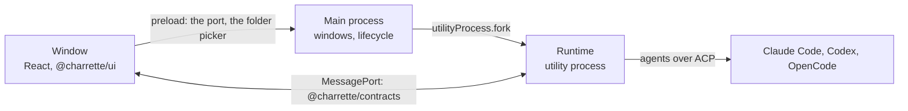

# @charrette/desktop — Architecture

The desktop shell of [docs/architecture/02](../../docs/architecture/02-desktop-runtime.md). The repository's [ARCHITECTURE.md](../../ARCHITECTURE.md) sets the general engineering target.

- **Owner:** Repository maintainers
- **Consumers:** people using Charrette.
- **Dependency direction:** the window depends on `@charrette/ui` and `@charrette/contracts`; the runtime's process on `@charrette/runtime`. The window never imports the runtime, and the kit never imports Effect.

## Processes

| Where | What it holds | What it never holds |
| --- | --- | --- |
| `src/main` | Windows, the app's lifecycle, the runtime's process and its restarts, the folder picker and folder grants, external links | Projects, tasks, rules, sessions |
| `src/preload` | The bridge: hands the page its port, and asks main for grants for picked and dropped folders | Node, the file system, a shell, paths |
| `src/runtime` | The runtime (`@charrette/runtime`), serving the API over each window's port | Anything about windows |
| `src/renderer` | The window: views, view models and the data layer (ADR-010) | Effect outside `data/`; Node |

## How they talk

- **Main starts the runtime** in a utility process, with the profile and worktree folders in its environment. The runtime opens the store, reconciles what an earlier launch left, and waits for ports. If it crashes, main starts it again and reloads each window, which reconnects; reconciliation makes that safe, and each task it touched says "Charrette restarted." More than three crashes in a minute end the app instead.
- **Each page load gets a fresh port.** On `did-finish-load`, main makes a `MessageChannelMain`, sends one end to the runtime and the other to the page through the preload. The runtime serves the API over it on a fiber of its own, until the window closes its client or the port goes.
- **The API is Effect RPC** (`@charrette/contracts`): typed calls, typed errors (`ApiError`, in words), and one stream, `Watch`. Every message is checked against its schema on both sides.
- **Commands carry the window's own ids.** The client makes one per command and, when the runtime gave no answer (rather than said no), tries once more under the same id; the runtime answers the retry from the first one's receipt.
- **Reads say where the feed stood.** Each list and thread read returns the change-feed cursor it read at, and a view model watches from there, so nothing between the read and the watch is missed. A watch that breaks picks up from the last change it heard.
- **What changes reaches the window two ways.** `Changed` comes from the store's change feed, with the thread it belongs to: a task's screen reads a changed item alone, and anything else about the thread reads the thread's head without its items. `Streaming` carries an agent's message or thought as far as it has come, at most every 80 ms, before the store has all of it; the thread shows it in place of the stored text until the store catches up.
- **A thread comes a page at a time:** the newest hundred items, and earlier pages when asked.
- **Folders come from main, as grants.** The folder picker and dropped folders go through main, which tells the runtime the folder and hands the window a grant; the window opens a project by its grant and never names a path (07).
- **Quitting asks the runtime to stop** every session and record it, and waits up to 20 seconds before the app goes.

## The window

MVVM in feature folders ([ADR-010](../../docs/decisions/010-desktop-app-mvvm.md)), under `src/renderer`:

| Folder | What it holds |
| --- | --- |
| `data/` | The client: Effect inside, plain promises and a subscription outside; the services view models reach through React |
| `features/start` | The agents on this Mac and the projects; opening a folder by the button, ⌘N or a drop |
| `features/project` | A project's tasks, and starting one: its worktree, then its lead |
| `features/task` | A task's thread as the kit's blocks, the calls waiting on you, and the composer |
| `shared/` | How agents and times are drawn |

Each feature holds its route (`route.tsx`), its view model (`use*.ts`), its view (`*View.tsx`) and its styles. `router.tsx` puts the routes together, with the place in the hash, since the page loads from a file.

## Principles

- **The kit draws; the app arranges.** Views compose `@charrette/ui` and add layout and page margins, nothing that looks like a component of its own. When a view needs something the kit lacks, it goes into the kit, with its stories.
- **The runtime owns the state.** View models hold what the runtime last said and what is streaming; they read again rather than patch.
- **The page is locked down** (07's renderer list). Sandboxed, context-isolated, no Node, a strict Content Security Policy, no new windows and no navigation away, no web permissions granted, and no paths. Links open in the person's browser, for `https:` and local `http:` only.
- **Test hooks stay out of packaged builds.** `CHARRETTE_FAKE_AGENTS` works only in a build made with `bun run build`; `bun run build:package` leaves the code out.
- **Words on screen follow [the glossary](../../docs/glossary.md).**

## Checks

- `bun run check`: format, type-aware lint and type checks.
- `bun run test:coverage`: view models and views with Testing Library against a fake client; the client against the real runtime over a `MessageChannel`, with the fake agent. Gated at 90% of lines and branches; the entry and the routes are left to the end-to-end tests.
- `bun run test:e2e`: the built app under Playwright, with the fake agent: a project, a task, a thread, a call answered, and the runtime crashing and coming back. `e2e/real.spec.ts` runs a real agent when asked.

## Gaps

- **No coordinator, no workflow graph.** A task is its lead; steps, reviews and the project conversation come with step 3 of the MVP plan.
- **Views are tested with Testing Library,** not with Storybook stories fed view-model output as ADR-010 says; the app has no Storybook of its own yet.
- **Tasks have no numbers.** The kit's headers show a task's number; the app shows the title alone.
- **An answered call disappears** once the thread is read again, rather than folding to a line saying what was said.
- **A packaged app started from the Finder** gets a short `PATH`, so agents on the user's own `PATH` (OpenCode, Claude's status check) may not be found. Development runs from a terminal and inherits its `PATH`.
- **No packaging, signing or updates yet.** The bundled adapters run on Electron's own binary as Node, so a signed app has to keep the RunAsNode fuse on; see the open questions.
