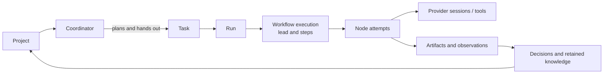
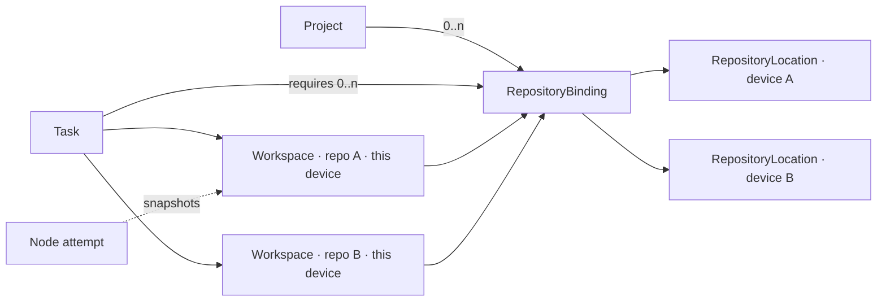

# Concepts and Project Model

## Purpose

This document introduces the durable concepts that the rest of the architecture
builds on: projects, the coordinator, repositories, devices, workspaces, tasks,
leads and steps, runs, conversations, and collaboration.

The key decision is:

> A project is a durable coordination space. It may refer to zero, one, or many
> repositories, but no repository, checkout, folder, or provider conversation
> is the project itself.

That definition supports the single-repository fast path without making it a
permanent architectural constraint.

## The concepts in one pass

The product can be understood as one chain:



- A **project** is the durable place where related work and knowledge remain.
- The **coordinator** is the project's agent that you talk to. It answers
  questions, plans and orders work, drafts tasks and hands them out, and never
  writes code. Its conversation belongs to the project; the agent session
  behind it is disposable ([04](04-coordinator.md)).
- A **repository binding** says which source repository the project means.
  Each computer maps that shared identity to its own local clone.
- A **task** describes desired work and which repositories it may use.
- A **run** is one submission of that task under a workflow and policy.
- A **workflow execution** is the durable graph of steps Althar coordinates.
- Each task has one **lead**: the agent that implements it and that you talk
  to about it. Its **steps**, such as review, run other agents as nodes of the
  graph and report back to the lead ([05](05-workflow-engine.md)).
- A **node attempt** is one try at a step.
- A **provider session** is the temporary Claude Code, Codex, OpenCode, or other agent
  conversation used by a node.
- An **observation** is something Althar saw; an **artifact** is retained
  evidence such as a patch, log, or report.
- A **decision** records human authority. A **knowledge claim** promotes useful
  evidence into context that may help future work.

The distinctions matter because these objects do not fail or expire together.
An agent conversation can disappear while the task, evidence, decisions, and
project remain valid. A repository can be detached without making old runs
unreadable.

## What a project owns

A `Project` groups work that shares intent, durable context, decisions, policy,
history, and collaborators. It may own:

- purpose and operating constraints;
- its coordinator thread: the whole conversation with the coordinator;
- tasks, runs, workflow executions, and attention requests;
- artifacts, evidence, decisions, and knowledge claims;
- memberships and execution policy;
- logical repository bindings;
- external-resource bindings;
- project-scoped skill bindings.

A project does not own:

- a universal filesystem root;
- a user's provider account;
- a device credential;
- an external issue's authoritative state;
- a provider conversation;
- every claim that may be useful to the organization.

Project is the first useful coordination and policy boundary. The scope model
must still admit task, repository, product, programme, team, organization, and
federated knowledge later. Each knowledge claim therefore records provenance,
scope, authority, visibility, confidence, temporal validity, supersession, and
revocation rather than assuming project membership is sufficient.

## Repository identity and location

Shared identity and device-local location are distinct:

| Concept | Ownership | Contains | Excludes |
|---|---|---|---|
| `RepositoryBinding` | Project authority | Binding ID, role, normalized remote fingerprints, provider repository ID where available, allowed subpaths, default base-ref policy | Local paths and credentials |
| `RepositoryLocation` | One device or runner | Binding ID, host ID, existing or managed path, observed remotes, access capabilities, last verification | Shared authority |
| `Workspace` | One task, one binding, one device | Concrete worktree, access mode, base commit, branch/ref, ownership, cleanup policy | Project identity |
| `WorkspaceSnapshot` | One moment in a workspace | The commit or tree the workspace held, and why it was taken (a node starting or ending, a switch, an interrupt) | Cross-repository atomicity claim |



A URL is useful evidence but is not a universal repository identity. Forks,
mirrors, aliases, remote renames, and local-only repositories require:

- normalized remote fingerprints;
- provider-native repository IDs where available;
- observed Git object relationships;
- explicit user confirmation when identity is ambiguous.

The same repository may be bound to more than one project. The binding, rather
than the repository, carries project-specific role, allowed subpaths, and
policy.

## Project and source setup UX

Two entrances lead to the same model.

### Open a folder

This is the fast path:

1. The user selects an existing folder or supplies one Git URL.
2. Althar reads it, changing nothing. The folder is one of three things:
   - **a repository:** the project has that one binding;
   - **a folder inside a repository,** such as one package of a monorepo:
     the binding is the whole repository, and names that folder. Agents
     start there and the coordinator reads from there, but the rest of the
     repository stays the task's to change, since monorepo work often spans
     packages;
   - **a folder holding repositories,** one level down and no further:
     Althar lists them, all kept, and the person leaves out any its tasks
     shouldn't change, or adds others from elsewhere. Hidden folders aren't
     looked in.
3. It creates the project with a binding per repository and, for local
   folders, a device-local location for each. The device remembers the
   folder it was opened at, so opening it again finds the project.
4. It suggests a project name, the folder's, and makes **Add source**
   permanently available.

The fast path must not create a hidden “single repository project” subtype.

### Create a project

The deliberate path lets a user:

- name the outcome or body of work;
- select several local repositories in one picker flow;
- enter several explicit clone URLs;
- mix existing clones and managed clones;
- create a repository-free project for research or planning.

Before confirmation, a project map shows:

- repository root and nested-repository findings;
- current branch and remotes;
- duplicate or fork ambiguity;
- selected monorepo subpaths;
- whether the source is local-only;
- suggested role such as `frontend`, `service`, `infrastructure`, or `docs`.

Althar must not recursively scan the computer or infer all sibling
repositories. Selection is explicit and bounded.

### Adding a binding on a device

Each device offers three operations:

1. **Use existing clone** — register an explicitly selected working copy
   without moving, resetting, or rewriting it.
2. **Clone on this device** — clone into an Althar-managed source area after
   destination and credential confirmation.
3. **Map later** — retain the logical binding while this device remains unable
   to execute work that needs it.

The persistent **Sources** view shows every binding's role, shared identity,
this device's location, observed revision, capabilities, and one of:
`ready`, `needs mapping`, `needs access`, `changed`, or `unavailable`.

Tasks, evidence, and decisions remain readable when a source is unavailable.

### Changing a project after it is made

A project's menu renames it, opens its repositories and its rules, and removes
it. Each change is recorded as a fact of the project, so every window reads
the project again.

- **Renaming** changes its name only. Its slug, and so the folders its tasks'
  worktrees are in, stays, and so does its mark, drawn from its id.
- **Adding** a folder binds the repositories at it, as opening it would find
  them: the one it is or is in, whole, or those directly inside it. One left
  out before comes back with its role and slug.
- **Leaving a repository out** sets its binding's `detached_at`. New tasks
  can't require it and the coordinator stops reading it; tasks made with it
  keep their requirement and their worktree. The last binding stays, since a
  task needs one.
- **A role** is one of the roles the Repositories screen offers, suggested
  from the repository's name. Tasks and the coordinator are told it.
- **A fork** is known from its clone's remotes, an `upstream` beside
  `origin` on the same host. Its binding says where tasks open pull requests:
  on the fork, as before, or on the repository it was forked from, from the
  fork's branch. The branch is pushed to the fork either way. A task made
  for the repository it came from starts from that repository's default
  branch, and its pull request targets it.
- **Removing** sets the project's `archived_at`. Its proposed plans are
  declined, its calls withdrawn and its runs cancelled, so no step reacts to
  its agents stopping; then every agent on it stops. Nothing starts in it
  after: no plan, no agent, and nothing said to one. Its folders, its tasks'
  worktrees and their branches stay where they are (ADR-006 never removes
  the person's worktrees for them), and opening its folder again makes a
  new project.

### Existing working copies

An existing clone is an input source, not the default execution workspace.
Althar prepares a Git worktree per task in a folder it owns,
`~/Althar/<project>/<task>/<repository>` by default, with a root that can
be changed per project ([ADR-006](../decisions/006-worktree-per-task.md)).
Opening the task's folder in an editor shows all its repositories together.
It never:

- changes the user's current branch;
- hides or stashes their changes;
- resets their working tree;
- removes their worktree;
- rewrites remotes;
- initializes Git without a separate explicit action.

A project can declare a setup command, run in each new worktree, and untracked
files to copy into it, such as `.env`.

Working on a plain branch in the user's own checkout may come later, as an
explicit per-project choice. It relaxes the rules above and must say so where
the choice is made.

For the MVP, writable source bindings are Git repositories. A plain directory
can be attached read-only as an artifact/source reference later, but making it
a mutable workspace would discard base-revision and change-provenance
guarantees.

## Multi-repository tasks and runs

A `TaskRepositoryRequirement` records:

- binding ID;
- read, write, or observe-only intent;
- optional allowed roots;
- requested base-ref policy;
- whether the binding is required or optional.

“All repositories in the project” is never an implicit capability. In a
project of several, the coordinator names a task's repositories when it
drafts it, and New task has the person tick them; with one, it is that one.
Its lead may still read the others where they are.

The task's worktrees sit side by side in its folder, each on the task's
branch, and its lead starts there: in the one worktree, or the folder in it
the project is about, where there is one; in the task's folder, where there
are several. Writing outside all of them asks. Each repository is published
on its own: a pull request where its host is connected, its branch where
it has none Althar knows. The task shows each pull request by its
repository, and a file it changed by its repository's name.

Run admission snapshots the task requirement revision. Later changes to a
binding, task, role, or default branch do not rewrite historical intent.

The preflight resolves all required bindings on one host:

- location and access capability;
- requested ref and resolved commit;
- dirty or moved-source condition;
- credential and provider availability;
- expected workspace strategy;
- read/write/tool grants;
- user-visible cost or authority escalation.

If a required binding is unresolved, the run does not partially start. The user
can map, clone, remove the requirement, or choose another capable host.

A task has one workspace per participating repository on each device,
created when its first run is admitted there. Every run, attempt and agent of
the task on that device shares it: the lead, its steps, and any agent that
takes the task over after a switch. Parallel steps in v1 only read, so one
workspace per repository is enough. A workspace snapshot records which commit
or tree the workspace held when each node attempt started and ended, at a
switch and at an interrupt, so what each step saw can always be found again.

Run admission copies the task's repository requirements onto the run, so
editing the task later never changes what a past run was allowed.

Cross-repository publication is not atomic. A resulting `ChangeSet`
groups independent `RepositoryChange` records:

- binding ID;
- base and head commit;
- patch/artifact digest;
- branch/ref;
- publication or PR status;
- verification evidence.

A partial result is an explicit outcome. Recovery never pretends several Git
repositories committed or published atomically.

## Collaboration and a second device

Shared project state includes repository binding metadata, never machine paths
or credentials.

On another device:

1. The project is readable immediately within its visibility policy.
2. Each binding starts `needs mapping` unless a verified local match already
   exists.
3. The user chooses an existing clone, a managed clone, or observer mode.
4. Read-only and write capabilities are verified separately.
5. The device advertises which task requirements it can satisfy.

In the MVP a project has one coordinator, on this device. Later each member
has their own coordinator thread and session, reading the shared project state
([04](04-coordinator.md)).

A collaborator may be allowed to read project history without source access.
Source availability is neither project membership nor permission to view every
artifact.

The MVP assigns an entire run to one host. Splitting a graph across machines
would require:

- cloud-authoritative leases and fencing;
- artifact and secret movement policy;
- cross-host cancellation;
- partial-connectivity semantics;
- placement and cost policy;
- trustworthy host capability attestation.

Those are later distributed-execution decisions.

## Binding lifecycle and edge cases

### Remote rename or change

Record the newly observed remote and ask for confirmation when identity is not
provable. Historical runs retain the binding ID and the remote evidence they
observed at the time.

### Folder moved

Mark the `RepositoryLocation` unavailable. Let the user relocate or remap it.
Never silently create a second logical binding.

### Fork selected instead of canonical repository

Show the identity mismatch and offer to:

- keep it as a distinct binding;
- record it as a permitted fork location;
- cancel mapping.

Do not equate matching names with matching repositories.

### Monorepo

Use one repository binding with declared allowed roots unless subprojects need
different membership, credentials, or policy. Do not create fake repositories
for every package.

### Nested repositories and submodules

Inspection reports them. Each independently changed Git repository needs a
binding. Submodule metadata alone does not grant the agent access to the nested
repository or its credentials.

### Detached or deleted binding

Detaching stops future selection but retains a tombstoned binding record so
historical tasks, runs, claims, and changes remain intelligible.

### Local-only repository

Allow local work, label it explicitly, and prevent another device from assuming
it can clone the source. Sharing metadata does not upload its contents.

### Same repository in several projects

Keep distinct binding IDs and project policies. A device may point them to the
same source location, while each run still receives its own managed workspace.

## Core lifetimes

| Entity | Created when | Terminal or replaced when |
|---|---|---|
| `Project` | User establishes a coordination space | Archived or explicitly deleted |
| `CoordinatorThread` | The project is created (later, one per member) | Archived with the project; never truncated |
| `RepositoryBinding` | Source identity joins a project | Detached/tombstoned |
| `RepositoryLocation` | A host maps or clones a binding | Remapped, unavailable, or removed |
| `Task` | Desired work is recorded | Completed, cancelled, or archived |
| `Run` | A task is submitted under a workflow and policy | Logical outcome chosen |
| `RunAttempt` | Execution or retry is admitted | Succeeded, failed, cancelled, interrupted |
| `Workspace` | A task's first run is admitted on a device | Retained, published, or cleaned with the task |
| `WorkspaceSnapshot` | A node attempt starts or ends, a switch, an interrupt | Immutable |
| `WorkflowExecution` | A workflow version is materialized for a run | Completed, cancelled, failed |
| `NodeAttempt` | A node is scheduled or retried | Succeeded, failed, cancelled, uncertain |
| `ProviderSession` | An adapter starts or resumes provider work | Provider terminal, lost, or superseded |
| `AttentionRequest` | Progress needs a human decision/input | Answered, expired, withdrawn |
| `Decision` | An actor answers an exact request | Immutable; may be superseded by a new decision |
| `KnowledgeClaim` | Evidence is promoted into durable context | Superseded, expired, or revoked |

Identifiers must never be reused across these lifetimes.

## Chat input queue and interruption

An Althar conversation is a durable interaction stream around a task, a run,
or the project's coordinator; it is not merely the provider's current stdin.
The coordinator's thread uses the same queue and dispositions as a task's. User input can arrive while the
runtime is sampling, waiting for a tool, executing a tool, awaiting approval, or
recovering.

Each accepted `UserInput` receives a thread-local sequence and an explicit
disposition:

```ts
type InputDisposition =
  | "after_current"
  | "interrupt_and_continue"
  | "supersede_pending"
  | "cancel_run"

type UserInput = {
  id: string
  threadId: string
  sequence: number
  commandId: string
  disposition: InputDisposition
  bodyArtifactId: string
  acceptedAt: string
}
```

The default meanings are intentionally different:

- **Send / after current** appends the input to the durable FIFO.
- **Interrupt and continue** asks the active turn to stop at the earliest safe
  boundary, moves this input ahead of ordinary pending input, and then continues
  the existing task with both its unfinished objective and the new instruction.
- **Supersede pending** explicitly replaces identified, not-yet-started input;
  it does not erase completed history.
- **Cancel run** terminates the run under its cancellation policy.

An interrupt is never interpreted as “forget what you were doing.”

### Two acknowledgements

Interruption has two observable facts:

1. `InterruptRequested` — the runtime durably accepted the user's request. The
   UI can acknowledge this immediately.
2. `TurnInterrupted` — the provider stopped, or Althar reached a safe
   boundary and fenced the old controller.

If the provider cannot confirm interruption, record
`InterruptionUncertain`. The new input remains queued, but Althar must
reconcile possible tool or external effects before retrying them.

### Continuing prior work

After interruption, the next turn receives:

- the original task objective and current workflow node;
- a summary/reference to completed and partially completed work;
- outstanding verification, cleanup, and follow-up obligations;
- the interrupting message;
- any earlier queued inputs in their original order.

The scheduler may revise the plan in light of the new message, but unfinished
work remains pending unless the user explicitly cancels it or the new
instruction is classified as superseding it. When intent is genuinely
ambiguous, the runtime should preserve work and ask a concise question rather
than silently discard it.

### Multiple inputs and races

- Message acceptance is idempotent by `commandId`.
- Sequence allocation and queue insertion commit transactionally.
- Multiple interrupting inputs retain arrival order.
- Only one active delivery exists per thread/controller generation.
- An input arriving as a turn completes is either included in that completion's
  next queue snapshot or delivered in the next turn, never lost.
- Approval responses are correlated commands, not ordinary chat strings.
- Restart rebuilds the queue from accepted, delivered, and terminal facts.
- A stale provider/controller cannot mark a newer input consumed.

Provider-native queue or steering support may optimize delivery, but the
Althar queue remains authoritative. An adapter without live steering uses
provider cancellation plus a new/resumed turn while preserving the same
semantics at the domain layer.

## Scope model

The MVP resolves project and task scopes, but persists an extensible reference:

```ts
type ScopeRef = {
  kind: string
  id: string
  authority: string
  revision?: string
}
```

Claims also require:

- provenance and supporting artifact references;
- creating actor or process;
- visibility and sharing policy;
- confidence and temporal validity;
- relationship to contradictory claims;
- supersession and revocation.

This avoids prematurely deciding that all useful engineering intelligence must
live beneath a project while keeping the MVP product coherent.

## Acceptance examples

1. A user opens repository A, adds repository B, and creates one task that may
   write A but only read B. The preflight, the run's copy of the requirements,
   and each workspace's access mode preserve that distinction.
2. A collaborator opens the project without access to B. They can read allowed
   decisions and evidence, but cannot start the task or infer another user's
   path.
3. A selected working copy has uncommitted changes. The run uses a managed
   worktree without stashing or changing that copy.
4. Repository B is detached after a run. Historical evidence still identifies
   the binding and commits used.
5. A project contains no repositories while research occurs; a repository is
   added later without changing project identity.
6. A user interrupts an active turn to add a constraint. The UI acknowledges
   the interrupt, the current turn stops, and the next turn continues the
   original task under the new constraint rather than treating it as a new
   unrelated task.
7. A user asks the coordinator for a small change. It drafts a task and a plan
   and hands the task to a lead; it does not edit the repository itself.
8. The user switches a task's lead to another agent mid-task. The new agent
   continues in the same workspace, from a brief, and the task's history keeps
   both sessions.

## Explicit non-goals

- Universal organization ontology in the MVP.
- Automatic discovery of every repository on a machine.
- Cross-repository transactions.
- Multi-host execution within one run.
- Treating a shared folder path as collaboration.
- Treating Git remote access as project membership.
- Mutating a user-selected working tree as a normal execution strategy (a
  plain-branch opt-in may come later; see Existing working copies).
