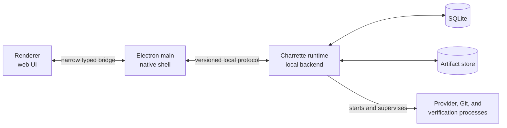

# Desktop Application and Local Runtime

## Purpose

This document explains how the local desktop application is divided, why that
division exists, and how the pieces communicate and recover.

The intended reader is comfortable building web or mobile applications but
does not need prior process-management knowledge.

## A web/mobile mental model

The desktop application has a UI and a local backend:

| Charrette component | Useful analogy | Responsibility |
|---|---|---|
| Electron renderer | A React web application or Flutter widget tree | Render state and collect user intent |
| Electron main process | A thin native mobile application shell | Create windows, handle application lifecycle, expose a narrow native bridge |
| Charrette runtime process | A backend service running only on the user's computer | Own domain rules, workflows, persistence, integrations, and long-running work |
| SQLite | The runtime's local relational database | Store canonical structured state |
| Artifact store | Local object storage | Store patches, logs, reports, and other large immutable files |
| Provider child process | A locally launched worker | Run Codex, Claude Code, Git, tests, or another tool |

The renderer should feel like a normal frontend talking to a typed backend API.
The main difference is deployment: both client and backend ship inside the
desktop product and communicate locally rather than over the public internet.

## What a process is

A **process** is a running program with its own memory and operating-system
identity. If one process crashes, another process can often remain alive.

Electron normally has at least:

- a **main process**, which owns windows and native application lifecycle;
- a **renderer process** for each window, which runs the web UI.

Charrette adds a **runtime process** for durable application logic and launches
provider/tool **child processes** when work runs.

This is not microservices. There is one installed product and one local
database. Process separation is used for fault and security boundaries, not
independent organizational ownership or network scaling.

## Topology



| Component | Owns | Must not own |
|---|---|---|
| Renderer | Presentation state, navigation, forms, accessibility | Shell commands, arbitrary paths, SQLite, secrets, process handles |
| Electron main | Windows, deep links, application quit, updates, narrow IPC bridge | Workflow rules, provider sessions, project state |
| Runtime | Commands, queries, policy, workflow scheduling, persistence, process supervision | Provider model loop or window state |
| Provider child | Provider-native conversation, model/tool loop, provider context | Charrette project or workflow truth |
| SQLite | Canonical local structured state | Large blobs or live process streams |
| Artifact store | Content-addressed immutable bytes | Mutable domain authority |

## Why the runtime is separate

Putting everything in the renderer would be familiar but unsafe:

- a UI bug or reload could interrupt long-running work;
- any cross-site scripting flaw would sit beside filesystem, shell, database,
  and credential APIs;
- multiple windows could accidentally become multiple writers;
- process cleanup and crash recovery would be coupled to component lifecycle;
- a future CLI or cloud/local runner could not reuse the control plane cleanly.

A separate runtime gives Charrette:

1. **One owner of durable state.** Only the runtime writes SQLite.
2. **One owner of child processes.** The code that launches a provider is also
   responsible for observing and stopping it.
3. **A security boundary.** The renderer receives narrow operations rather than
   Node.js or shell access.
4. **A recovery point.** The runtime can compare persisted facts with processes
   and files after a crash.
5. **More than one client later.** The desktop UI and a diagnostic CLI can use
   the same typed contract.

The runtime is packaged as a separate executable, but Electron supervises it.
The MVP does not install a background daemon or operating-system service.

## Lifecycle walkthrough

### Application startup

1. Electron main starts.
2. It resolves the bundled runtime binary from the application installation,
   not from the current repository or arbitrary `PATH`.
3. It launches the runtime with a fresh local authentication secret and a
   profile directory.
4. Main and runtime exchange protocol and application versions.
5. The runtime opens/migrates SQLite, checks artifact storage, and reconciles
   work that was active before the previous shutdown.
6. Only after the runtime reports ready does the renderer receive project data.

If the runtime version is incompatible or migration fails, the UI shows a
recovery state. It must not fall back to partially opening the database itself.

### An ordinary UI action

When a user renames a project:

1. The renderer sends a typed command such as `RenameProject`.
2. The runtime validates the payload, actor, project revision, and policy.
3. SQLite commits the new name, record event, change notification, and command
   receipt atomically.
4. The runtime returns the receipt.
5. The renderer refreshes the affected projection.

This is conceptually the same as a web client calling an API. The transport is
local, but validation and concurrency rules still matter.

### Long-running work

When a workflow node starts an agent:

1. The runtime commits that the attempt was admitted.
2. It creates or selects the managed workspace.
3. It launches the provider as an owned child process.
4. Structured provider events become durable Charrette observations.
5. UI notifications update the visible projection.
6. The workflow interprets completion, failure, approval, or uncertainty.

The runtime never holds a SQLite transaction open while an agent, Git command,
test, or network call is running.

### Window close and application quit

Closing a window is not necessarily the same as quitting the application. A
window can close while the runtime and active work continue.

Explicit application quit:

1. checks for active work;
2. explains what will be interrupted;
3. requests graceful cancellation if the user proceeds;
4. waits a bounded period;
5. forcibly terminates owned processes that did not exit;
6. records what was confirmed and what remains uncertain;
7. closes persistence cleanly.

The product should never imply that work survives full application termination
unless an independent runner/daemon actually exists.

### Runtime crash

The main process may restart the runtime, but restart is not equivalent to
repeating work.

On recovery, the runtime compares:

- persisted attempt and controller identities;
- provider session identifiers;
- owned process observations;
- workspace state;
- external mutation receipts;
- last committed event sequences.

An in-flight attempt becomes `reconciling`. It resumes, fails, or asks for
attention based on evidence. It does not silently start a duplicate provider or
repeat an external mutation.

## Communication model

Treat the local protocol like a private, typed API.

### Commands

A command asks the runtime to change authoritative state:

```ts
type CommandEnvelope<T> = {
  commandId: string
  commandType: string
  schemaVersion: number
  actorId: string
  deviceId: string
  aggregateId: string
  expectedRevision?: number
  issuedAt: string
  payload: T
}
```

The runtime:

- schema-validates every command;
- rejects stale `expectedRevision` values;
- uses `commandId` for idempotency;
- commits state and its receipt together;
- returns the previous receipt when a client safely retries the same command.

### Queries

Queries return projections shaped for screens. They do not expose SQL tables or
mutable domain objects directly. Every unbounded result is paginated.

### Change notifications

Notifications tell the UI that a projection changed. They carry a resumable
cursor so a sleeping or reloaded renderer can catch up.

Do not conflate:

1. **Record events** — durable facts a user may inspect.
2. **Change notifications** — compact UI invalidation messages.
3. **Provider event capture** — diagnostic/adapter input.
4. **Future replication messages** — cloud authority transfer.

They have different compatibility and retention requirements.

## Local transport

The transport may initially be an Electron/Node local channel such as a
`MessagePort` or authenticated local socket. The domain API must not depend on
which one is chosen.

Required properties:

- request/response correlation;
- schema and protocol version negotiation;
- a per-launch authentication secret;
- bounded message and stream sizes;
- cancellation;
- resumable change cursors;
- backpressure when the UI cannot consume events;
- structured errors rather than leaked stack traces;
- no listening on a public network interface.

A local socket is useful when a separate CLI must connect. A direct
Electron-owned channel is simpler when only the desktop client exists.

## Child processes and supervision

### Child process

A **child process** is another program launched by the runtime—for example
Codex, Git, or a test runner. Standard input/output (`stdio`) are byte streams
through which the runtime may send requests and receive structured events.

Starting a process is easy. Owning its complete lifecycle is the hard part.

The runtime records:

- which attempt launched it;
- executable identity and version;
- operating-system process identity;
- start time;
- controller generation;
- redacted arguments and environment digest;
- provider session identity when available;
- last observed structured event.

### Process tree

A provider may launch shells, tools, language servers, or tests. Those form a
**process tree**. Stopping only the first process can leave descendants running.

On Unix-like systems, Charrette uses an owned process group. On Windows it uses
a Job Object or equivalent tree-owning mechanism. These are OS mechanisms for
addressing all processes launched for one attempt as a unit.

Cancellation is layered:

1. ask the provider to stop using its supported protocol;
2. allow a short grace period for cleanup;
3. terminate the owned process group/tree;
4. verify what actually exited;
5. persist any uncertain state.

Never kill by executable name, and never trust an old process ID without
verifying ownership; operating systems can reuse IDs.

### Supervisor

A **supervisor** is simply the component responsible for starting, observing,
restarting, and stopping another process. Electron main supervises the
Charrette runtime. The runtime supervises provider/tool children.

Supervision does not mean “always restart.” Restart is correct for the runtime
after a crash; automatically rerunning an agent or deployment may duplicate an
effect. Domain reconciliation decides that separately.

### Controller generation and fencing

A run attempt can outlive the in-memory worker currently controlling it. When a
worker is replaced, Charrette increments the attempt's **controller
generation**. Every later write includes the generation it belongs to; storage
rejects writes from older generations.

This is similar to optimistic concurrency on an API resource. The incrementing
number is a **fence**: it prevents a slow or disconnected old worker from
reporting success after a replacement worker has taken control.

**Reconciliation** is the read-only investigation that happens before deciding
what to do next. Charrette compares the database, process state, provider
session, workspace, and external system rather than assuming that a timeout or
crash means nothing happened.

## In-memory versus durable state

Use a simple test:

> If losing this fact on restart could duplicate work, lose user intent, or
> make history misleading, persist it before acting on it.

Persist:

- accepted commands and chat input;
- run/node admissions and attempts;
- graph versions;
- approvals and authority grants;
- process/provider identities needed for reconciliation;
- external mutation intents and receipts;
- artifact references and evidence.

Keep ephemeral:

- open UI panels;
- transient animation state;
- replaceable caches;
- active stream buffers after their durable sequence is known.

The UI may optimistically render a requested change, but it reconciles against
the runtime's authoritative receipt.

## Source repository shape

One product repository keeps jointly changing contracts and implementations
together:

```text
apps/
  desktop/
  cli/                    # optional diagnostic/control client
packages/
  contracts/              # versioned client/runtime schemas
  domain/                 # entities, commands, policies, projections
  runtime/                # composition root and process supervision
  persistence-sqlite/
  workflow/
  provider-adapters/
  integration-connectors/
  mcp-broker/
  skills/
  ui/
  testkit/
```

These are package boundaries, not network services:

- `domain` imports no Electron, provider, connector, or SQLite implementation;
- adapters depend inward on domain ports and contracts;
- `runtime` composes implementations and owns side effects;
- `desktop` speaks through the control-plane contract;
- contract suites for adapters/connectors live in `testkit`;
- production UI primitives stay with the product until they need an independent
  release.

A private cloud repository is justified when the cloud service exists. It
shares only versioned wire contracts and deliberately exported pure policy
packages, not arbitrary desktop/runtime internals.

## Alternatives rejected

### Put everything in Electron main

This reduces packaging work but mixes window lifecycle, privileged IPC, domain
state, and long-running execution. It makes crashes and testing harder and
encourages renderer-specific APIs.

### Put everything in the renderer

This gives untrusted web content excessive authority and makes UI lifecycle the
owner of durable work.

### Install a permanent daemon immediately

A daemon can survive application quit and serve several clients, but adds
installation permissions, service management, upgrades, discovery, and support
burden before the product needs them.

### Split into local microservices

Independent processes for workflow, integrations, providers, and persistence
would introduce networking, version skew, distributed failure, and deployment
complexity without independent scale or team ownership.

## Architecture checks

- A renderer compromise cannot directly open SQLite, invoke a shell, read the
  keychain, or access arbitrary paths.
- Two windows cannot become competing database writers.
- Retrying one command returns the original receipt.
- Runtime restart rebuilds client projections and reconciles active work.
- Closing a window does not accidentally cancel work.
- Explicit quit explains and records interruption.
- Cancellation addresses the complete owned process tree.
- A stale controller cannot write after replacement.
- No transaction remains open during provider, Git, filesystem, or network I/O.
- A diagnostic CLI can use the same versioned contract without importing
  runtime internals.

## References

- [Electron process model](https://www.electronjs.org/docs/latest/tutorial/process-model)
- [Electron security checklist](https://www.electronjs.org/docs/latest/tutorial/security)
- [Electron utility process API](https://www.electronjs.org/docs/latest/api/utility-process)
