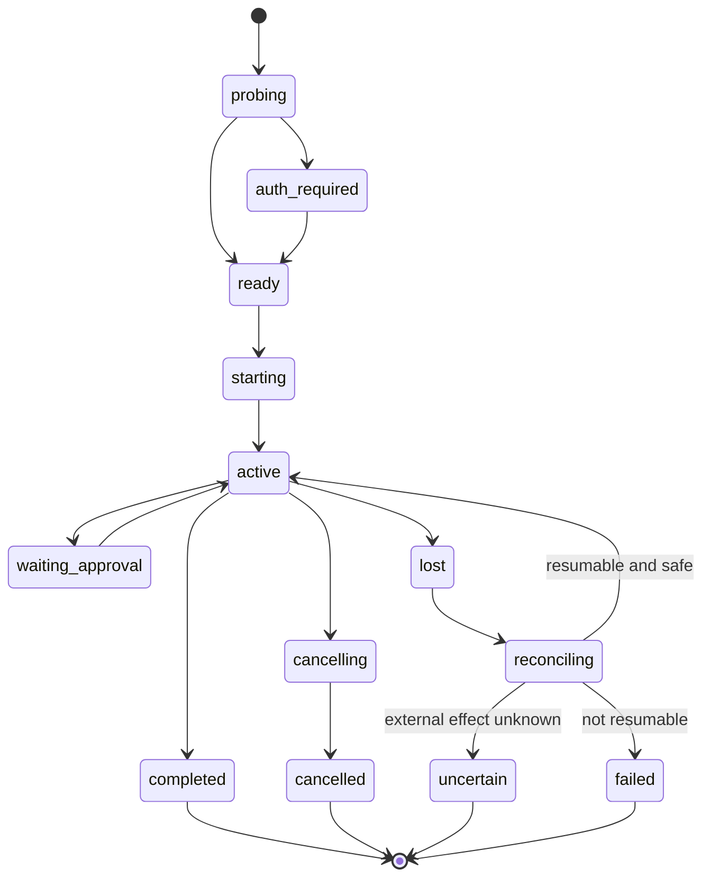

# Agent Runtime and Authentication

## Architectural decision

Charrette is an agent harness in the same sense that a workflow scheduler is a
job harness: it supplies durable intent, policy, lifecycle, recovery, and
evidence around execution. It is not a new foundation-model runtime.

The boundary is:

| Charrette owns | Provider runtime owns |
|---|---|
| Project, task, run, graph, attempts | Model request loop |
| Scheduling and host placement | Context window and provider compaction |
| Workspace preparation and repository grants | Provider-native tools and subagents |
| Policy, approvals, budgets, attention | Native conversation representation |
| Skill resolution and instruction bundle | Provider prompt/session mechanics |
| Normalized observations and retained evidence | Token refresh and provider account protocol |
| Restart reconciliation and repair | Provider-specific retry within one call/session |
| Cross-provider and cross-run record | Provider-native usage/accounting detail |

If Charrette implements both columns, it inherits the hardest and fastest-moving
parts of Codex, Claude Code, and every future provider while weakening the
durable project layer that differentiates it.

## Adapter contract

The domain depends on an internal `ProviderRuntimeAdapter`, not directly on a
vendor SDK, CLI schema, or ACP revision.

```ts
interface ProviderRuntimeAdapter {
  probe(request: ProbeRequest): Promise<ProviderInstallation>
  authenticate(request: AuthRequest): Promise<AuthResult>
  capabilities(request: CapabilityRequest): Promise<CapabilityReport>
  start(request: StartSessionRequest): AsyncIterable<ProviderEvent>
  resume(request: ResumeSessionRequest): AsyncIterable<ProviderEvent>
  respond(request: RespondRequest): Promise<void>
  cancel(request: CancelSessionRequest): Promise<CancelResult>
  inspect(request: InspectSessionRequest): Promise<ProviderSessionObservation>
}
```

The adapter reports, rather than fakes, capabilities:

- structured events and their schema version;
- session/conversation resumption;
- streaming;
- tool-approval hooks;
- file and image attachments;
- model and reasoning selection;
- usage/cost reporting;
- cancellation and hard termination;
- live steering, queued input, and interruption acknowledgement;
- native subagents or handoffs;
- MCP configuration;
- skill/instruction injection;
- sandbox or execution-location claims;
- supported authentication modes.

Unsupported capabilities are explicit. Provider independence means capability
negotiation plus isolated translation, not erasing differences into an
unreliable lowest common denominator.

## Integration tiers

Prefer the highest supported tier for each provider:

| Tier | Mechanism | Policy |
|---|---|---|
| A | Native supported SDK or structured service protocol | Preferred; pin versions and translate at the adapter boundary |
| B | Stable Agent Client Protocol implementation | Useful generic transport; negotiate capabilities and protocol version |
| C | Documented headless CLI with structured JSON/events | Supported with stricter lifecycle and compatibility tests |
| D | PTY/TUI scraping or undocumented local protocol | Experimental only; never the default correctness path |

Charrette must never parse ANSI terminal presentation as its canonical event
stream. A terminal may be exposed as a user surface, but execution truth comes
from a documented structured channel or remains explicitly uncertain.

## Codex recommendation

### App-server integration

Codex app-server is the best initial candidate for a rich integration because
OpenAI documents it for clients that need authentication, conversation
history, approvals, and streamed agent events. It uses JSON-RPC over stdio by
default, while WebSocket support is currently an alternative transport. Its
schemas are generated per Codex CLI version.

Use stdio for this integration:

- the process is child-owned and naturally scoped to one local runtime;
- no local port discovery or firewall behavior is needed;
- input/output lifetime follows the owned process;
- protocol messages can be recorded after redaction;
- app-server version and generated schema can be part of the adapter support
  matrix.

The adapter contract must demonstrate:

1. initialization and capability/version negotiation;
2. login-required and account-switch behavior;
3. starting and resuming a conversation;
4. streaming item/event ordering;
5. approval request/response round trips;
6. cancellation versus process termination;
7. input queued during output and interrupt-and-continue behavior;
8. crash behavior during a tool action;
9. unknown or added protocol fields;
10. bounded log retention and redaction;
11. behavior across the oldest and newest supported CLI versions.

Do not promote app-server identifiers into `Task` or `Run` IDs. They are stored
as a provider-owned `ProviderSession` identity.

### SDK fallback

The Codex SDK is a simpler fit for programmatic local automation: start or
resume threads and receive structured results without implementing the full
client protocol. It is the fallback if app-server packaging or lifecycle proves
too volatile for the MVP.

The trade-off is less control over the complete client interaction surface.
Compatibility and lifecycle evidence, not architectural taste, chooses between
app-server and SDK.

### Codex CLI fallback

A documented non-interactive structured-output mode can satisfy Tier C, but it
must still expose enough information to:

- distinguish provider failure from task failure;
- bind approval to an exact action where available;
- cancel the complete child process tree;
- record a resumable identifier or explicitly report no resume;
- prevent human-formatted output from becoming domain state.

## ACP and generic interoperability

The Agent Client Protocol is promising because its protocol covers
initialization and capability negotiation, authentication, session creation and
resumption, prompts, cancellation, updates, and permission requests over
JSON-RPC.

Charrette should use an official ACP SDK for providers that implement a stable
ACP version, but should not make ACP objects its domain model:

- ACP is a client-agent transport, not a project, workflow, integration, or
  persistence model.
- Protocol drafts and capability growth must be quarantined inside an adapter.
- Codex app-server is not assumed to be ACP.
- Charrette needs durable graph and authority semantics even if every provider
  eventually speaks ACP.

The adapter converts ACP sessions and notifications into Charrette
`ProviderSession` and `Observation` records while retaining the raw protocol
version for diagnostics.

## Where agent frameworks fit

The OpenAI Agents SDK, LangGraph, or another agent framework may later execute a
Charrette-authored agent node when Charrette itself owns that node's model/tool
loop.

They do not replace:

- Codex or Claude Code as full coding-agent runtimes;
- the project/repository/workspace model;
- external-system synchronization;
- the durable cross-run record;
- workflow authority and policy.

Use specialists or handoffs only when prompts, tools, or policies genuinely
differ. Spawning agents is not a substitute for decomposing a graph into
durable, observable nodes.

## Provider session lifecycle



A provider session state does not directly set the run outcome. The workflow
node interprets normalized observations under its retry, verification, and
external-effect policy.

Every provider controller writes with the run attempt's
`controllerGeneration`. A stale controller may contribute attributable
diagnostic observations, but it cannot advance canonical state.

## Process ownership

For every child process, persist:

- executable identity and resolved version;
- adapter and protocol version;
- parent/child ownership identity;
- process-group/job-object strategy;
- start time and host identity;
- provider session ID if obtained;
- last observed event sequence;
- redacted launch arguments and environment allowlist digest;
- controller generation.

Cancellation is layered:

1. send provider-native cancellation;
2. wait a bounded grace period;
3. terminate the owned process group/job object;
4. verify liveness;
5. mark survivors and unknown effects explicitly.

Never kill by executable name or an unverified reused PID.

## Authentication model

Authentication is modeled with three concepts:

```ts
type ProviderPrincipal = {
  id: string
  provider: string
  subjectHint: string
  authMode: "vendor_cli" | "api_key" | "oauth" | "enterprise" | "workload"
  hostScope: string
  observedAt: string
}

type CredentialRef = {
  id: string
  owner: "vendor_cli" | "os_keychain" | "cloud_secret_store"
  locator: string
  exportable: false
}

type ExecutionGrant = {
  id: string
  principalId: string
  provider: string
  allowedHostId: string
  allowedProjectIds: string[]
  allowedOperations: string[]
  expiresAt?: string
  policyRevision: number
}
```

`ProviderPrincipal` records who Charrette believes the provider session
represents. `CredentialRef` points to the supported custodian; it is not a copy
of the credential. `ExecutionGrant` is Charrette policy authorizing use of that
principal for a bounded purpose.

### Vendor CLI and subscription login policy

Some providers offer a useful local CLI authenticated through a consumer or
team subscription but no supported API equivalent. Presence of that CLI is a
capability, not permission to extract or relay its session.

Rules:

1. The official CLI owns login, refresh, logout, and credential storage.
2. Charrette may invoke documented status/login commands or react to a
   structured `auth_required` response.
3. Charrette never reads, scrapes, copies, decrypts, exports, uploads, or
   synchronizes the CLI's credential cache.
4. It never asks for a provider password or browser session cookie.
5. Subscription-backed execution runs on the user's device and only where the
   provider's current documentation and terms permit that use.
6. Charrette cloud stores the fact that a device reports a capability, not the
   underlying subscription token.
7. Remote or hosted execution requires a provider-approved API key, OAuth
   grant, workload identity, service credential, or enterprise access token.
8. If no supported remote credential exists, the correct architecture is a
   local runner—not credential emulation.
9. Account switching is explicit and recorded. A run snapshots the observed
   principal and aborts or seeks approval if it changes.
10. Logging redacts tokens, authorization headers, cookies, device codes, and
    provider-defined secret fields before persistence.

This is both safer and more durable than coupling Charrette to the current shape
of a vendor's private auth cache.

### API keys and OAuth

When a provider supports programmatic credentials:

- use the OS keychain locally;
- store only a keychain locator in SQLite;
- scope environment injection to the single owned child;
- never forward the entire parent environment;
- redact command lines and diagnostics;
- support revocation and key rotation;
- require cloud-side secret storage for cloud runners;
- show which principal, billing context, and host will be used before execution.

Device authorization and OAuth callbacks must use the provider's documented
native-app flow. A local loopback callback or claimed HTTPS scheme requires
state/PKCE validation and exact redirect handling.

## Capability and support matrix

Each released adapter declares:

- minimum/maximum tested runtime versions;
- protocol/schema versions;
- operating systems and architectures;
- authentication modes;
- supported and degraded features;
- known unsafe or blocked versions;
- last compatibility-test date.

At launch:

1. resolve the executable without trusting repository-local PATH shadowing;
2. inspect version and signature/provenance where practical;
3. perform a cheap capability handshake;
4. compare against the matrix;
5. choose supported, degraded, or blocked behavior;
6. persist the actual result with the run.

Automatic provider upgrades must not silently change an in-flight run's
adapter semantics. An app update can add support, but active sessions stay tied
to the adapter/protocol version with which they began.

## Approval boundary

Provider-native permission prompts are inputs to Charrette policy, not a
replacement for it.

An `ApprovalRequest` records:

- normalized action and parameters;
- action digest;
- affected repositories, paths, tools, external systems, and credentials;
- relevant diff/artifact/input hashes;
- provider session and workflow node;
- policy revision and reason;
- expiry and one-time/multi-use behavior.

The `Decision` records actor, outcome, reasoning, time, and consumption. If an
input or action changes, the digest changes and the decision no longer applies.

Examples requiring Charrette-level handling include:

- destructive Git operations;
- external messages, issue transitions, deployments, or merges;
- using a new repository binding or MCP server;
- introducing a skill script;
- increasing budget or loop bounds;
- graph patches that expand authority.

## Repository and prompt trust

Repositories, issue bodies, tool output, MCP responses, provider messages, and
skills are all untrusted input.

Controls:

- do not place provider credentials in a repository workspace;
- do not let repository content alter the runtime's adapter configuration
  without a reviewed project policy path;
- delimit source-derived instructions and record their origin;
- constrain Charrette-owned filesystem operations to registered roots;
- allowlist child environment variables;
- require explicit grants for MCP tools and external mutations;
- record the exact skill and instruction snapshot sent to the provider;
- treat provider claims about completed actions as observations until verified.

Host-native execution uses the current user's OS authority and must be labeled
**trusted-host execution**, not “sandboxed”. Container or remote sandbox support
is a separate `ExecutionHostAdapter` with its own capabilities.

## Failure semantics

The adapter classifies failures without collapsing them:

| Class | Example | Default response |
|---|---|---|
| `auth_required` | Logged out or expired grant | Pause and request authentication |
| `unsupported_version` | CLI schema outside support matrix | Block or degraded mode; never guess |
| `transient_provider` | Rate limit or temporary network failure | Bounded retry with jitter and provider hint |
| `invalid_request` | Unsupported model/tool option | Fail node with actionable detail |
| `provider_refusal` | Policy refusal | Record terminal provider outcome |
| `process_lost` | Child vanished | Reconcile session and external effects |
| `cancel_uncertain` | Kill issued but effect unknown | Attention/verification before retry |
| `protocol_violation` | Malformed or impossible event sequence | Quarantine adapter/session and retain redacted diagnostics |

The UI displays the consequence and recovery options, not raw stack traces or a
single generic “agent failed” label.

## Verification gates

- No test obtains a provider token by reading a vendor credential cache.
- Logging and diagnostic export contain no seeded secret canary.
- Supported CLI versions pass the same contract suite.
- Unknown event fields do not crash the adapter; impossible transitions do.
- Provider restart and Charrette restart are tested at every lifecycle boundary.
- Provider-native steering, where present, preserves Charrette's durable input
  order; where absent, cancellation plus resume/new turn preserves the same
  interrupt-and-continue semantics.
- A stale controller cannot advance state after replacement.
- Cancellation kills the complete owned process tree on every target OS.
- An account switch invalidates the prior execution grant.
- A provider without resume support cannot be presented as resumed.
- Host-native execution is never labeled sandboxed.

## References

- [Codex app-server](https://learn.chatgpt.com/docs/app-server)
- [Codex SDK](https://learn.chatgpt.com/docs/codex-sdk)
- [Codex authentication](https://learn.chatgpt.com/docs/auth)
- [OpenAI Agents SDK orchestration](https://developers.openai.com/api/docs/guides/agents/orchestration)
- [Agent Client Protocol repository](https://github.com/agentclientprotocol/agent-client-protocol)
- [ACP protocol overview](https://github.com/agentclientprotocol/agent-client-protocol/blob/main/docs/protocol/v2/overview.mdx)
- [OAuth 2.0 for native apps, RFC 8252](https://www.rfc-editor.org/rfc/rfc8252.html)
