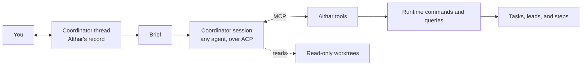

# Coordinator

## Decision

Each project has a coordinator: the agent you talk to about the project as a
whole. It plans work and hands it out. It never writes code.

> The coordinator is an ordinary agent session with Althar's tools and
> read-only access to the repositories. Althar keeps its conversation. The
> provider session is disposable.

See [ADR-004](../decisions/004-coordinator-is-an-agent-session.md).

## What it does

- answers questions about the project, its code, and its work;
- plans work, drafts tasks, and orders a batch of them;
- triages and refines tickets, once a tracker connector exists
  ([06](06-integrations-and-skills.md));
- recommends a lead model per task, with its reasons, from the models it can
  use now and what is known of each ([05](05-workflow-engine.md),
  [ADR-015](../decisions/015-coordinator-picks-models.md));
- shows a task's plan before it starts: steps, a model per step, optional
  steps, and a short countdown after which the plan starts on its own. In the
  MVP the plan is always one fixed graph with its choices filled in
  ([MVP plan](../plans/mvp.md)); composing a graph per task comes next;
- follows the work, and passes messages to a task's lead;
- judges task permission requests when the project selects that mode, in a
  fresh read-only session using its agent and model, without delaying the
  conversation ([ADR-019](../decisions/019-coordinator-judges-permissions.md)).

It never edits a repository, runs builds or tests, or merges, even for a
one-line change. A change is always a task with a lead.

## Shape



The coordinator runs on the same adapter as every other agent
([03](03-agent-runtime-and-auth.md)). What makes it the coordinator is its
role: its brief, its tools, and its read-only rule.

## Read-only by construction

Read-only is enforced by what the coordinator can reach, not by its prompt,
in three layers ([ADR-004](../decisions/004-coordinator-is-an-agent-session.md)).
A reviewer, the other role that only reads, gets the same.

- It reads throwaway copies. Its working directory is an Althar-owned
  folder holding one worktree per bound repository, detached at the default
  branch. They are refreshed from the remote's default branch when you start
  a turn, so nothing written there survives or reaches a task. A project with
  no repositories gets an empty folder. A reviewer reads a copy of the lead's
  worktree, snapshotted when its round begins, so it reads what the round is
  about even if the lead moves on, and the record keeps which code it was.
- The agent's own sandbox is read-only where it has one that still lets it
  call Althar's tools: Codex's `read-only` sandbox, and Claude Code with its
  edit tools denied (which also denies its sandbox's writes) and every shell
  command asking. Claude Code's plan mode and OpenCode's plan agent would be
  simpler, but both refuse MCP tools. OpenCode has no sandbox yet, so for it
  the copy is the boundary.
- Althar's reader rules are the backstop. They allow reads, searches and
  fetches, and commands that only look, each with the flags it may take (no
  `rg --pre`, `git -c`, `sort -o`). They refuse everything else with a reason,
  and never ask you.
- Its only way to change anything is its tools. They issue the same commands
  the interface does: validated, recorded, idempotent, and never beyond your
  own authority.

## Althar tools

Althar gives the coordinator an MCP server at `session/new`. Names are
provisional.

| Tool | What it does | Kind |
|---|---|---|
| `project_overview` | Rules, repositories, notes | Read |
| `list_tasks`, `read_task` | Status, plan, steps, lead, change | Read |
| `read_thread` | Earlier turns of a task's thread or its own, by range | Read |
| `read_change` | A task's diff and checks | Read |
| `draft_task` | Creates a task in draft, with its repositories and intent: a title of a few words (at most 60 characters), and what the person last said to it kept as what they asked for, which the task's thread opens with and its lead reads | Command |
| `list_models` | The models it can use now, by maker, with their scores | Query |
| `propose_plan` | Steps, a model per step, optional steps | Command |
| `start_task` | Starts a planned task, through the countdown | Command |
| `order_tasks` | Orders a batch | Command |
| `message_lead` | Sends a message to a task's lead, queued or as an interrupt | Command |
| `recommend_lead` | Records a lead recommendation and its reasons | Command |

The same server serves every session. The read tools are how a lead, a step,
or an agent that took over a task reads the record its brief left out. Command
tools are granted per role; a lead gets none of the coordinator's.

## Conversation and context

The conversation with you is Althar's record, kept in full with the
project. The provider session is a working copy of it.

The session is rebuilt from a brief ([03](03-agent-runtime-and-auth.md)) when:

- the coordinator is first opened;
- the app restarts and the agent can't load the old session;
- you switch the coordinator's agent;
- later, when the session has grown past a threshold.

The coordinator's brief holds the project's rules and notes, its instructions
for the role, and as many recent turns as fit, verbatim. The board and older
turns are read through its tools, not pasted in.

### The compaction seam

In the MVP, the agent's own compaction manages a long session, and a rebuild
uses recent turns plus the tools. Althar writes no summaries yet.

Continuous compaction will write summaries as records:

```ts
type ThreadSummary = {
  id: string
  threadId: string
  coversFromSequence: number
  coversToSequence: number
  artifactId: string
  writtenBy: string // agent and model
  createdAt: string
}
```

A brief then uses the latest summaries for what came before its verbatim
turns. The interface can show older conversation at lower detail from the
same records. Nothing else needs to change for this to arrive.

## Task events

Task status changes reach the coordinator thread as task cards that Althar
posts, a projection of task facts. The coordinator agent doesn't write them.

In the MVP the coordinator agent is prompted only by your messages. It reads
task state through its tools when it needs it. Whether it is also prompted
when a batch it planned needs its next task is open.

## Agent, model, and usage

- The coordinator can run on any agent, and switches like a lead: the new
  agent takes over the whole thread.
- It is always on and runs on your plan, so its default model matters for
  cost. Which default is open.
- When its account runs out, it switches under the project rule like any
  session. Tasks keep running; the coordinator never blocks a task.

## One per project, then one per person

In the MVP there is one coordinator per project, on this device. Later, each
developer has their own coordinator, with its own thread and session, reading
the shared project state ([07](07-persistence-security-and-cloud.md)). Nothing
in the tools assumes one coordinator: every command carries its actor.

## Open questions

- Its default model.
- Whether task events prompt it, and which.
- Whether it can start a task without the countdown when you asked for exactly
  that task.
- When continuous compaction summarises, and with which model.

## Verification gates

- The coordinator cannot change a repository even if its agent tries.
- Every tool call is a recorded, idempotent command with an actor.
- Rebuilding the session loses no turn of the thread.
- Switching the coordinator's agent keeps the thread.
- A coordinator out of usage pauses no task.
