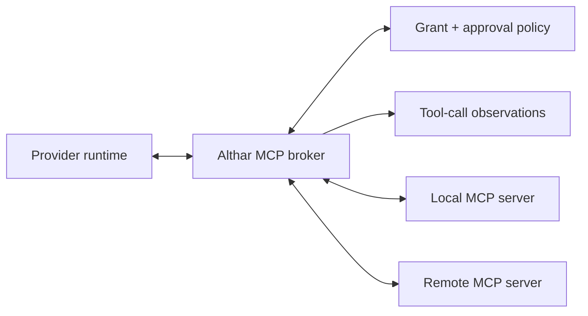

# Integrations and Skills

## Architectural decision

“Integration” currently hides four different architectural relationships.
Althar must model them separately:

| Plane | Purpose | Examples | Authority |
|---|---|---|---|
| `AgentConnection` | Execute agent work | Claude Code, Codex, OpenCode over ACP | Provider owns its session; Althar owns the run |
| `DomainConnector` | Synchronize durable business/domain state | GitHub/GitLab, Linear, Jira | External system owns its resources; Althar owns mappings and workflow state |
| `MCPConnection` | Expose callable tools and resources to an agent | Search, databases, SaaS actions | Tool server owns operation; Althar owns grant and audit |
| `SkillPackage` | Supply procedural knowledge and supporting resources | Review workflow, migration playbook | Package author owns content; Althar owns resolution and permission policy |

Combining these behind a generic “plugin” interface would erase their different
lifecycles, authentication, retry semantics, security boundaries, and UX.

## Domain connector model

A `DomainConnector` handles durable reconciliation with a known external
system. It is appropriate when Althar needs:

- background or resumable synchronization;
- stable mappings between external and internal resources;
- webhooks or cursors;
- field ownership and conflict policy;
- outbound idempotency;
- mutation receipts;
- reconciliation after unknown outcomes;
- first-class product UI.

Core entities:

```ts
type IntegrationConnection = {
  id: string
  provider: "github" | "gitlab" | "linear" | "jira" | string
  accountId: string
  installationId?: string
  principalId: string
  credentialRefId: string
  capabilities: string[]
  status: "ready" | "reauth_required" | "degraded" | "revoked"
  policyRevision: number
}

type ExternalResourceBinding = {
  id: string
  connectionId: string
  projectId: string
  externalType: string
  externalId: string
  externalUrl?: string
  localType: string
  localId: string
  mappingRevision: number
}

type ExternalMutationReceipt = {
  id: string
  commandId: string
  connectionId: string
  externalOperation: string
  idempotencyKey?: string
  requestDigest: string
  externalRequestId?: string
  status: "accepted" | "confirmed" | "rejected" | "unknown"
  observedAt: string
}
```

Also persist:

- `ExternalIdentity` for actor/user mapping;
- `SyncCursor` for pull-based checkpoints;
- `WebhookSubscription` and expiry when applicable;
- `ExternalObservation` for source-stamped inbound facts;
- `ReconciliationIssue` for divergence requiring policy or human input.

## Synchronization semantics

Every connector defines a field-ownership table before it writes externally.

Example:

| Field | Authority | Inbound behavior | Outbound behavior |
|---|---|---|---|
| Issue title | External tracker by default | Update projection and record source revision | Only explicit user/workflow mutation |
| Althar run status | Althar | Never overwritten by tracker | Optionally summarized into a dedicated external field/comment |
| Assignee | Configured per project | Import and map external identity | Require mapping and permission |
| Workflow evidence | Althar artifacts | External links become observations | Publish a link/summary, not canonical bytes |
| External issue state | Tracker | Cursor/webhook observation | Idempotent requested transition |

“Bidirectional sync” without field ownership is a loop generator, not a
feature.

### Inbound path

1. Verify webhook signature, timestamp, tenant, and subscription identity.
2. Deduplicate by provider delivery ID plus payload digest.
3. Persist the raw metadata required for audit, with secret/body redaction.
4. Convert into provider-stamped observations.
5. Apply the connector's mapping and field-ownership policy in one command.
6. Advance the cursor/subscription checkpoint only after commit.
7. Reconcile periodically because webhooks can be delayed, duplicated, or
   missed.

### Outbound path

1. Create an Althar command and durable mutation intent.
2. Evaluate actor, connection, project, and field-level policy.
3. Attach a provider-supported idempotency key where available.
4. Perform the network operation outside the database transaction.
5. Store the response/request ID and a mutation receipt.
6. Confirm via read-after-write or later inbound observation.
7. If the response is lost, classify the effect `unknown` and reconcile before
   retrying a non-idempotent action.

Outbound comments and descriptions include a stable origin marker in metadata
where supported. Inbound processing recognizes that marker to prevent echo
loops without ignoring legitimate human edits.

### Backpressure and rate limits

Connectors use:

- per-connection queues and concurrency limits;
- provider retry/reset hints;
- exponential backoff with jitter;
- bounded batch sizes;
- priority for interactive actions over background hydration;
- circuit breakers for authentication and systemic failures;
- a visible `next attempt` and manual retry;
- no tight polling loop.

Rate-limit state is operational data, not a reason to mutate project truth.

## Local versus cloud ingress

A local desktop application cannot reliably receive public webhooks while it is
offline, behind NAT, or closed.

The local MVP therefore uses:

- explicit refresh;
- refresh on project open;
- incremental cursor-based pull while the application is running, of what
  something listens to (a task's pull requests until it settles), with each
  service's cheapest form of "anything new?" (GitHub's conditional requests,
  an updated-since cursor elsewhere);
- provider-native local callbacks solely for documented auth flows.

It does not silently create a public tunnel.

A cloud deployment adds a public webhook ingress that:

- verifies and durably queues deliveries before acknowledgement;
- resolves tenant and connection;
- deduplicates/replays safely;
- fans into canonical cloud commands;
- notifies or leases work to local runners where needed.

Webhook availability does not make the external system Althar's command
authority.

## Code hosts and trackers

Code hosts and trackers are `DomainConnector`s of Althar's own, on each
service's API, never MCP wrappers
([ADR-011](../decisions/011-own-connectors-for-hosts-and-trackers.md)). There
are two models, a code host and a tracker. Each has one adapter per *product*,
not per brand: Bitbucket Cloud and Bitbucket Data Center are different APIs,
and so are Jira Cloud and Jira Data Center. Each adapter declares its
capabilities; screens and agents' tools offer only what it has, in the
service's own words ("merge request !12" on GitLab, "pull request #12"
elsewhere). Each model has a fake, which tests and the desktop's end-to-end
suite use, and a contract suite that runs against the fake in CI and against
real accounts on demand, as the agents' does.

Both models were laid against all six services before any adapter was
written. A model whose terms only one service has is a sign it is that
service's model.

### Code hosts

| | GitHub (and Enterprise Server) | GitLab (and self-managed) | Bitbucket Cloud | Bitbucket Data Center | The model |
|---|---|---|---|---|---|
| Repository | `owner/name` | Nested groups, `a/b/c/project`, and a numeric id | `workspace/repo_slug` | `PROJECT/repo_slug` | A path of segments, plus the host's own id |
| The change | Pull request #12 | Merge request !12 (`iid`, per project) | Pull request #12 | Pull request #12 | A number; the adapter gives the words |
| Draft | Every repository. Marked ready over GraphQL only | `Draft:` in the title | A `draft` flag | 8.18 and later | Capability `drafts` |
| State | open, closed, merged | opened, closed, merged, locked | open, merged, declined, superseded | open, merged, declined | open, merged, closed |
| Verdict | Approved, changes requested, commented | Approved, requested changes | Approved, request changes | Approved, needs work | approved, changes requested, commented |
| Threads | Review threads on lines, resolvable; conversation comments aren't | Discussions, resolvable | Top-level comments resolvable | Threads, resolvable; blocker comments | A thread: optional place in the diff, resolvable, resolved, comments |
| Checks | Check runs and commit statuses; Actions logs | The head pipeline's jobs, with logs | Build statuses; Pipelines step logs | Build statuses; Code Insights reports | A check: name, state, link; logs as a capability |
| Listening, polling | ETags (a "not modified" reply is free) | ETags too; a merge request's threads are read whole, having no `updated_after` | `updated_on` | The pull request's activities | A cursor per thing listened to |

- **Pushing is git,** with the connection's token, never the person's
  credential helper. Althar pushes what the lead committed and commits
  nothing itself; a step that ends in a push isn't done while the worktree
  has uncommitted files, so the lead commits what belongs to the task and
  clears away the rest. The record keeps the commit pushed.
- **A pull request is described in the repository's template,** where it
  has one in the places its host looks (GitHub's
  `pull_request_template.md`, GitLab's default merge request template,
  Bitbucket Cloud's). The lead writes the description in it, as a teammate
  would; Althar asks it to before the step can end. Althar keeps the
  template's headings and checklists, unticks every box, and adds the
  review below. A description that drops the template is replaced by the
  template with the lead's summary in its place for one. Templates kept
  elsewhere (an organisation's `.github` repository, a host's settings)
  aren't read yet.
- **After the first push, pushing is the person's.** When a plan's steps are
  done, Althar pushes the branch and opens the pull request. What the lead
  commits after, answering the person, a review or failed checks, waits on the
  task's branch until the person has looked at it and pushes it: the task
  says how many commits aren't on the pull request yet, and Push pushes up to
  the commit they saw, never one the lead made since. The lead has no tool to
  push.
- **A repository without a pull request merges here, as the person says.**
  Where a task ended on its branch (no host Althar knows, a host not
  connected, or "push the branch only"), the person can merge it into each
  of its repositories' default branches on this Mac, up to the commit they
  saw in each. In a task of several, the ones with a pull request merge
  through it, and the button names the others ("Merge tools into main").
  - It is worked out for every repository first, without any working tree,
    so a conflict anywhere merges nothing and says which files.
  - The default branch then moves: as a ref where nothing has it checked
    out, or by a fast-forward in the working tree that has it. That needs
    nothing uncommitted there, and no file git doesn't track where the merge
    puts one, so the person's own work is never touched.
  - Refs move first and checkouts last. A checkout that refuses anyway
    (something written there since) puts back what moved, so it is all or
    none.
  - Nothing is pushed by the merge. Once merged, the task says whether each
    default branch's remote has it yet, and Push sends it there with the
    person's own git sign-in (their keychain or SSH agent), as they would from
    a terminal; a prompt for a password fails rather than waits. A remote that
    has moved on refuses, and the task says to pull first.
  - A conflict with the default branch offers to have the lead resolve it: a
    note to the lead naming the files, sent as the person's own message, to
    merge the default branch into its branch, settle each conflict, and
    commit. The person merges again after.
- **A task is done once each of its repositories is merged:** its pull
  request merged, or, where it has none, its branch in its default branch
  here. A pull request closed without merging keeps the task open. Until
  then, the thread says which is still open.
- **Merging is the person's.** The model has `merge`, and Althar calls it
  only when the person accepts the change (from the board, or the task),
  never on an agent's word: the rules refuse agents' merges. A draft is
  marked ready first, and only the head Althar last read is merged, in the
  first way the repository allows.
- **A repository's host** is found from its remote URL, matched against
  known hosts and the instances the person has connected.

**Listening to a pull request** while the app runs:

- **Asked often while it's busy,** every 30 seconds, and every five minutes
  once nothing has happened on it for ten. Each call is conditional where the
  host allows (GitHub's ETags: a "not modified" reply doesn't count against
  its rate limit).
- **Everything arrives in the task's thread,** once: comments, reviews,
  checks finishing, merged, closed, marked ready. Bots aside.
- **Only some of it reaches the lead.** Failed checks do, with the end of
  their logs: the lead fixes and commits, and the person pushes. So do comments and reviews from the person and from people who
  can write to the repository (GitHub's owners, members and collaborators).
  On a public repository anyone can comment, so what anyone else says stays in
  the thread, marked as not passed on, for the person to pass on in their own
  name. Reading the pull request, the lead sees the same, and how much was
  left out.
- **Althar's own replies** are known by their receipts, not by who posted
  them: they go up under the person's account, which is also where the
  person comments. Each says it came from Althar, and which agent wrote
  it.

### Trackers

| | Linear | Jira (Cloud, Data Center) | Trello | GitHub and GitLab issues | The model |
|---|---|---|---|---|---|
| Where issues live | Team (key `MER`), project, cycle | Project (key), board, sprint, epic | Board, list | Repository or project | A container, by the tracker's name for it |
| Key | `MER-231` | `PROJ-123` | Card short link | `#123` | The tracker's key |
| Text | Markdown | ADF (Cloud), wiki markup (Data Center) | Markdown | Markdown | Markdown; the Jira adapters convert |
| Status | The team's states, typed: triage, backlog, unstarted, started, completed, canceled | Statuses in To Do, In Progress, Done; changed by a transition, which may need fields | The card's list | Open or closed with a reason; GitLab's statuses in five categories | The tracker's name, and a category: triage, backlog, to do, started, done, cancelled |
| Linking a PR | An attachment; Linear's Git integration links branches named with the key | A remote link; the development panel needs Jira's own Git apps, by key | An attachment | A reference | A link, and the key in the branch and the PR's title |

- **Status by category.** Althar asks for a category, and the adapter
  picks the tracker's state. A Jira transition that needs fields becomes a
  call for the person. Trello's lists are mapped by the person, once per
  board. Who moves an issue's status, and when, is an open question.
- **The key goes in the branch and the PR's title,** so the trackers' own
  Git integrations link them. Field ownership (above) decides whether
  Althar also moves a status those integrations move.

### Signing in

A desktop app can't keep a secret, so each service's way in depends on
whether it gives a token without one:

| Service | Hosted | Self-hosted |
|---|---|---|
| GitHub | Althar's GitHub App, by device flow; no secret, refresh included | A pasted token (the app is registered per instance) |
| GitLab | Device flow | Device flow if the instance has Althar registered; else a pasted token |
| Bitbucket | A pasted scoped API token | A pasted HTTP access token |
| Linear | OAuth with PKCE, back to a loopback address | n/a |
| Jira | A pasted scoped API token (Atlassian's OAuth needs a secret) | A pasted personal access token |
| Trello | Althar's Power-Up key, and a user token from Trello's authorize page | n/a |

A pasted token is the fallback everywhere, including for an organisation
that won't install the GitHub App. A connection belongs to the person on
this device. Its token is sealed by the app with Electron's `safeStorage`,
whose key the system keychain keeps for the signed app alone, and kept in a
file of its own in the profile; the store keeps only a reference to it.
Another process, an agent's shell among them, can read the file but not
open it: asking the keychain for the key prompts the person. The runtime
asks the app's main process to seal and open, and never holds the key. The
command-line client has no key, so connections stay the app's.

### Agents and the hosts

Agents reach code hosts and trackers only through Althar:

- **Althar's own steps** push the task's branch, open its pull request and
  mark it ready.
- **Althar's tools** let agents read a pull request (comments, reviews,
  checks with their logs) and an issue, and reply on a pull request. They
  reach only the task's own repository, and every call is recorded.
- **Agents run without the person's ways into a host:** `gh` and `glab`
  signed out, git's credential helpers reset (`credential.helper` empty, in
  git's environment), git's prompts off, and no SSH agent. Althar pushes
  for them. The environment is the boundary.
- **The rules refuse** `gh` and `glab` commands that change a host, with a
  reason that names Althar's tool; and, for every role, the ways to
  credentials a shell still has: the keychain's `security`, and git's helpers
  called directly. Credentials the person keeps in plain files under their
  home folder remain readable to an agent that goes looking; only a sandbox
  closes that (open question).
- **What slips through is adopted:** opening a pull request first looks for
  one already open on the task's branch.

A change set may link several pull requests, one per repository, but it never
claims their merge is atomic. Publication and merge policy is evaluated per
repository and then projected into a grouped outcome.

## MCP architecture

MCP is the right standard for agent-callable tools and resources. It is not the
right default for durable product synchronization.

### Local broker

The recommended target is an Althar MCP broker:



The broker:

- discovers configured servers outside untrusted repositories;
- negotiates server/protocol capabilities;
- exposes only project/run-allowed tools and resources;
- maps provider tool calls to exact grants;
- redacts and records call metadata and result artifacts;
- enforces timeout, output-size, concurrency, and network policy;
- translates provider-specific MCP configuration where necessary.

ACP gives each session its MCP servers at `session/new`, so Althar decides
per session what an agent can reach, whatever the agent's own configuration
says. Every session gets Althar's own tools server
([04](04-coordinator.md)) and the broker's allowed servers.

When direct provider MCP configuration is allowed, record its exact
configuration digest and treat pass-through as an explicit adapter capability.
It has weaker uniform audit and enforcement than the Althar broker.

### MCP grants

Tool visibility, invocation permission, and approval policy are separate:

```ts
type MCPToolGrant = {
  serverId: string
  toolName: string
  projectId: string
  runId?: string
  allowedArgumentShape?: unknown
  approval: "never" | "policy" | "always"
  maxCalls?: number
  expiresAt?: string
  policyRevision: number
}
```

A skill declaring an MCP dependency can trigger preflight. It cannot create a
grant.

### MCP tasks

Newer MCP task capabilities may help represent long-running tool operations,
but Althar still wraps them in a workflow node/attempt. MCP task status is an
external observation, not Althar's run authority.

## Skills

Althar should adopt the open Agent Skills package shape:

```text
skill-name/
  SKILL.md
  scripts/       # optional
  references/    # optional
  assets/        # optional
```

The `SKILL.md` front matter and body provide discovery metadata and
instructions; referenced files are loaded progressively. Althar can add a
manifest sidecar for provenance and compatibility without forking the content
format.

### Skill is not workflow, tool, or connector

- A **skill** explains how to perform a class of work and may package resources.
- A **workflow** defines durable execution order, state, recovery, and bounds.
- A **tool/MCP server** provides a callable capability.
- A **connector** maintains a typed durable relationship with an external
  system.

A skill may reference a workflow template, require a tool, or explain a
connector-specific procedure. It does not inherit their authority or lifecycle.

### Skill entities

```ts
type SkillDefinition = {
  id: string
  name: string
  source: string
  publisher?: string
}

type SkillVersion = {
  id: string
  definitionId: string
  contentHash: string
  manifest: unknown
  trust: "builtin" | "verified" | "local" | "untrusted"
  installedAt: string
}

type SkillBinding = {
  id: string
  skillVersionId: string
  scope: ScopeRef
  activation: "explicit" | "eligible"
  precedence: number
  policyRevision: number
}

type SkillResolutionSnapshot = {
  id: string
  runId: string
  resolvedSkills: Array<{
    skillVersionId: string
    contentHash: string
    sourceScope: ScopeRef
    activationReason: string
  }>
  compiledInstructionHash: string
  dependencyPreflightHash: string
}
```

### Scope and precedence

Supported sources may include:

1. built-in/product;
2. organization/admin;
3. user;
4. project;
5. repository;
6. task;
7. workflow node.

Precedence is explicit and inspectable. Two skills with the same name or
conflicting instructions are not silently concatenated. The resolver either:

- selects the higher-precedence pinned version;
- applies a declared composition rule;
- or produces a preflight conflict.

Provider-native discovery behavior is treated as an adapter feature. A
multi-repository project cannot rely on whichever repository root the provider
happens to consider current.

### Resolution and reproducibility

At run admission:

1. discover eligible bindings for the task and node;
2. resolve explicit pins and conflicts;
3. inspect required runtimes, scripts, MCP servers, and connector capabilities;
4. evaluate trust and permission policy;
5. compile the provider-specific instruction/asset representation;
6. hash and persist the exact resolution snapshot;
7. show blocking dependencies before execution.

An in-flight run never switches to a newly installed or edited skill. Retry
uses the snapshot unless the user creates an explicit migrated attempt.

Critical workflow nodes pin skill versions. Implicit semantic activation is
reserved for advisory, low-authority work because model-dependent discovery is
not sufficiently reproducible for destructive or external actions.

### Multi-repository skill delivery

Do not copy a project skill into every repository or mutate selected working
copies.

The provider adapter chooses among:

- native user/project skill configuration;
- a generated run-level instruction bundle;
- a read-only managed overlay within the task's workspaces;
- explicit prompt attachments.

The run records what the provider actually received and excludes managed skill
overlays from repository changes.

### Skill scripts

Scripts are executable code, not documentation.

- installation and update show publisher, provenance, content hash, and changed
  executable files;
- untrusted or newly changed scripts require review/policy approval;
- scripts execute with the node's existing filesystem, network, secret, and
  process grants—never more;
- dependencies are pinned or resolved through an approved environment;
- output is bounded and recorded as observations/artifacts;
- automatic updates never affect active runs;
- deleting a skill does not delete historical snapshots.

Signed provenance is useful, but a signature establishes publisher identity,
not safety.

### Skill testing

Each maintained skill should have:

- metadata/schema validation;
- broken-reference and dependency checks;
- trigger-selection evals;
- representative behavior tests;
- negative tests for non-triggering and denied capabilities;
- compatibility tests against supported provider adapters;
- secret-canary and workspace-boundary tests for scripts.

## External auth boundaries

Every integration connection records a principal and opaque credential
reference. The same principles as provider auth apply:

- use vendor-supported OAuth/app installation/API credentials;
- keep local secrets where only Althar can open them: sealed by the app,
  with a key the OS keychain keeps for the app alone ("Signing in", above);
- never place credentials in skills, repository config, or MCP arguments;
- separate account connection from project authorization;
- make tenant/workspace/site selection explicit;
- revoke grants and invalidate sessions when a connection is removed;
- avoid transferring a local subscription/session credential to cloud.

An MCP server may implement its own OAuth flow. The broker stores the connection
and scopes independently from the provider runtime so switching agents does not
silently switch SaaS authority.

## Verification gates

- A project can connect an issue tracker without granting it to every run.
- Duplicate or reordered webhooks converge without duplicate mutations.
- A lost outbound response produces `unknown` until reconciliation.
- Echoed Althar-originated changes do not loop indefinitely.
- Rate-limit exhaustion cannot block unrelated connections.
- Local-only operation never requires a public tunnel.
- MCP discovery does not imply invocation permission.
- A skill dependency cannot grant an MCP tool, credential, or filesystem root.
- A modified skill cannot affect an active run.
- Multi-repository skill delivery leaves selected working copies unchanged.
- Revoking a connection stops new calls while retaining redacted historical
  evidence.

## References

- [Model Context Protocol 2026-07-28 update](https://blog.modelcontextprotocol.io/posts/2026-07-28/)
- [Official MCP TypeScript SDK](https://ts.sdk.modelcontextprotocol.io/v2/)
- [Codex skills](https://learn.chatgpt.com/docs/build-skills)
- [OpenAI plugin architecture](https://developers.openai.com/plugins/concepts/plugins)
- [Agent Skills specification](https://agentskills.io/specification)
- [Linear OAuth](https://linear.app/developers/oauth-2-0-authentication)
- [Linear webhooks](https://linear.app/developers/webhooks)
- [Linear rate limits](https://linear.app/developers/rate-limiting)
- [Jira Cloud webhooks](https://developer.atlassian.com/cloud/jira/software/webhooks/)
- [Jira Cloud rate limiting](https://developer.atlassian.com/cloud/jira/platform/rate-limiting/)
