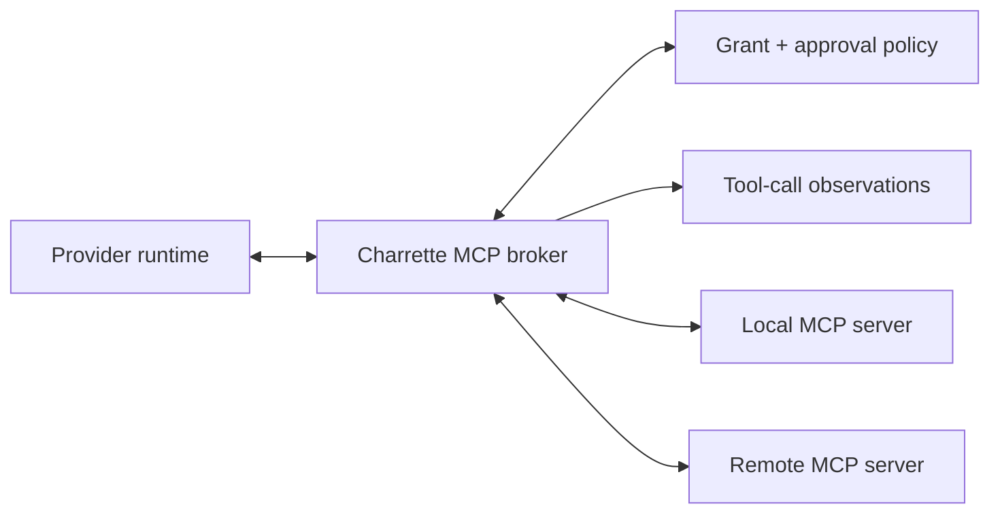

# Integrations and Skills

## Architectural decision

“Integration” currently hides four different architectural relationships.
Charrette must model them separately:

| Plane | Purpose | Examples | Authority |
|---|---|---|---|
| `ProviderRuntimeAdapter` | Execute agent work | Claude Code, Codex, OpenCode over ACP | Provider owns its session; Charrette owns the run |
| `DomainConnector` | Synchronize durable business/domain state | GitHub/GitLab, Linear, Jira | External system owns its resources; Charrette owns mappings and workflow state |
| `MCPConnection` | Expose callable tools and resources to an agent | Search, databases, SaaS actions | Tool server owns operation; Charrette owns grant and audit |
| `SkillPackage` | Supply procedural knowledge and supporting resources | Review workflow, migration playbook | Package author owns content; Charrette owns resolution and permission policy |

Combining these behind a generic “plugin” interface would erase their different
lifecycles, authentication, retry semantics, security boundaries, and UX.

## Domain connector model

A `DomainConnector` handles durable reconciliation with a known external
system. It is appropriate when Charrette needs:

- background or resumable synchronization;
- stable mappings between external and internal resources;
- webhooks or cursors;
- field ownership and conflict policy;
- outbound idempotency;
- mutation receipts;
- reconciliation after unknown outcomes;
- first-class product UI.

Core entities:

```ts
type IntegrationConnection = {
  id: string
  provider: "github" | "gitlab" | "linear" | "jira" | string
  accountId: string
  installationId?: string
  principalId: string
  credentialRefId: string
  capabilities: string[]
  status: "ready" | "reauth_required" | "degraded" | "revoked"
  policyRevision: number
}

type ExternalResourceBinding = {
  id: string
  connectionId: string
  projectId: string
  externalType: string
  externalId: string
  externalUrl?: string
  localType: string
  localId: string
  mappingRevision: number
}

type ExternalMutationReceipt = {
  id: string
  commandId: string
  connectionId: string
  externalOperation: string
  idempotencyKey?: string
  requestDigest: string
  externalRequestId?: string
  status: "accepted" | "confirmed" | "rejected" | "unknown"
  observedAt: string
}
```

Also persist:

- `ExternalIdentity` for actor/user mapping;
- `SyncCursor` for pull-based checkpoints;
- `WebhookSubscription` and expiry when applicable;
- `ExternalObservation` for source-stamped inbound facts;
- `ReconciliationIssue` for divergence requiring policy or human input.

## Synchronization semantics

Every connector defines a field-ownership table before it writes externally.

Example:

| Field | Authority | Inbound behavior | Outbound behavior |
|---|---|---|---|
| Issue title | External tracker by default | Update projection and record source revision | Only explicit user/workflow mutation |
| Charrette run status | Charrette | Never overwritten by tracker | Optionally summarized into a dedicated external field/comment |
| Assignee | Configured per project | Import and map external identity | Require mapping and permission |
| Workflow evidence | Charrette artifacts | External links become observations | Publish a link/summary, not canonical bytes |
| External issue state | Tracker | Cursor/webhook observation | Idempotent requested transition |

“Bidirectional sync” without field ownership is a loop generator, not a
feature.

### Inbound path

1. Verify webhook signature, timestamp, tenant, and subscription identity.
2. Deduplicate by provider delivery ID plus payload digest.
3. Persist the raw metadata required for audit, with secret/body redaction.
4. Convert into provider-stamped observations.
5. Apply the connector's mapping and field-ownership policy in one command.
6. Advance the cursor/subscription checkpoint only after commit.
7. Reconcile periodically because webhooks can be delayed, duplicated, or
   missed.

### Outbound path

1. Create a Charrette command and durable mutation intent.
2. Evaluate actor, connection, project, and field-level policy.
3. Attach a provider-supported idempotency key where available.
4. Perform the network operation outside the database transaction.
5. Store the response/request ID and a mutation receipt.
6. Confirm via read-after-write or later inbound observation.
7. If the response is lost, classify the effect `unknown` and reconcile before
   retrying a non-idempotent action.

Outbound comments and descriptions include a stable origin marker in metadata
where supported. Inbound processing recognizes that marker to prevent echo
loops without ignoring legitimate human edits.

### Backpressure and rate limits

Connectors use:

- per-connection queues and concurrency limits;
- provider retry/reset hints;
- exponential backoff with jitter;
- bounded batch sizes;
- priority for interactive actions over background hydration;
- circuit breakers for authentication and systemic failures;
- a visible `next attempt` and manual retry;
- no tight polling loop.

Rate-limit state is operational data, not a reason to mutate project truth.

## Local versus cloud ingress

A local desktop application cannot reliably receive public webhooks while it is
offline, behind NAT, or closed.

The local MVP therefore uses:

- explicit refresh;
- refresh on project open;
- incremental cursor-based pull while the application is active;
- low-frequency bounded polling only when the user enables it;
- provider-native local callbacks solely for documented auth flows.

It does not silently create a public tunnel.

A cloud deployment adds a public webhook ingress that:

- verifies and durably queues deliveries before acknowledgement;
- resolves tenant and connection;
- deduplicates/replays safely;
- fans into canonical cloud commands;
- notifies or leases work to local runners where needed.

Webhook availability does not make the external system Charrette's command
authority.

## Linear and Jira

Both should be first-class `DomainConnector` implementations, not generic MCP
wrappers, if Charrette promises project/task synchronization.

### Linear

Use Linear OAuth for user-installed connections and signed webhooks when cloud
ingress exists. The connector must handle workspace/team selection, actor
mapping, pagination/cursors, webhook retries, and documented rate limits.

### Jira

Jira Cloud adds site, project, issue-type, workflow, field-schema, permission,
and installation variability. The adapter must treat transition availability
and custom field schemas as runtime capabilities, not assumptions. Webhook
expiry/renewal, duplicates, retry identifiers, and Atlassian rate-limit
responses belong in the connector contract.

### Connector scope

The architecture does not require simultaneous Linear and Jira support. One
complete connector—read, map, mutate, receipt, and reconciliation—is enough to
establish the contract. The selected tracker should match the serious user
cohort. A second connector is the test of the shared abstraction, not the reason
to invent speculative commonality.

## Git hosting

Git itself remains the authority for objects and refs. A GitHub/GitLab
connector owns hosting concepts:

- repository installation and identity;
- pull/merge requests;
- checks and review status;
- remote branch publication;
- webhook/cursor reconciliation;
- external actor mapping.

Local Git credentials are not automatically valid for hosting APIs. A
repository binding and an integration connection remain separate even when
they refer to the same remote.

A multi-repository `ChangeSet` may link several PRs, but it never claims their
merge is atomic. Publication and merge policy is evaluated per repository and
then projected into a grouped outcome.

## MCP architecture

MCP is the right standard for agent-callable tools and resources. It is not the
right default for durable product synchronization.

### Local broker

The recommended target is a Charrette MCP broker:



The broker:

- discovers configured servers outside untrusted repositories;
- negotiates server/protocol capabilities;
- exposes only project/run-allowed tools and resources;
- maps provider tool calls to exact grants;
- redacts and records call metadata and result artifacts;
- enforces timeout, output-size, concurrency, and network policy;
- translates provider-specific MCP configuration where necessary.

ACP gives each session its MCP servers at `session/new`, so Charrette decides
per session what an agent can reach, whatever the agent's own configuration
says. Every session gets Charrette's own tools server
([04](04-coordinator.md)) and the broker's allowed servers.

When direct provider MCP configuration is allowed, record its exact
configuration digest and treat pass-through as an explicit adapter capability.
It has weaker uniform audit and enforcement than the Charrette broker.

### MCP grants

Tool visibility, invocation permission, and approval policy are separate:

```ts
type MCPToolGrant = {
  serverId: string
  toolName: string
  projectId: string
  runId?: string
  allowedArgumentShape?: unknown
  approval: "never" | "policy" | "always"
  maxCalls?: number
  expiresAt?: string
  policyRevision: number
}
```

A skill declaring an MCP dependency can trigger preflight. It cannot create a
grant.

### MCP tasks

Newer MCP task capabilities may help represent long-running tool operations,
but Charrette still wraps them in a workflow node/attempt. MCP task status is an
external observation, not Charrette's run authority.

## Skills

Charrette should adopt the open Agent Skills package shape:

```text
skill-name/
  SKILL.md
  scripts/       # optional
  references/    # optional
  assets/        # optional
```

The `SKILL.md` front matter and body provide discovery metadata and
instructions; referenced files are loaded progressively. Charrette can add a
manifest sidecar for provenance and compatibility without forking the content
format.

### Skill is not workflow, tool, or connector

- A **skill** explains how to perform a class of work and may package resources.
- A **workflow** defines durable execution order, state, recovery, and bounds.
- A **tool/MCP server** provides a callable capability.
- A **connector** maintains a typed durable relationship with an external
  system.

A skill may reference a workflow template, require a tool, or explain a
connector-specific procedure. It does not inherit their authority or lifecycle.

### Skill entities

```ts
type SkillDefinition = {
  id: string
  name: string
  source: string
  publisher?: string
}

type SkillVersion = {
  id: string
  definitionId: string
  contentHash: string
  manifest: unknown
  trust: "builtin" | "verified" | "local" | "untrusted"
  installedAt: string
}

type SkillBinding = {
  id: string
  skillVersionId: string
  scope: ScopeRef
  activation: "explicit" | "eligible"
  precedence: number
  policyRevision: number
}

type SkillResolutionSnapshot = {
  id: string
  runId: string
  resolvedSkills: Array<{
    skillVersionId: string
    contentHash: string
    sourceScope: ScopeRef
    activationReason: string
  }>
  compiledInstructionHash: string
  dependencyPreflightHash: string
}
```

### Scope and precedence

Supported sources may include:

1. built-in/product;
2. organization/admin;
3. user;
4. project;
5. repository;
6. task;
7. workflow node.

Precedence is explicit and inspectable. Two skills with the same name or
conflicting instructions are not silently concatenated. The resolver either:

- selects the higher-precedence pinned version;
- applies a declared composition rule;
- or produces a preflight conflict.

Provider-native discovery behavior is treated as an adapter feature. A
multi-repository project cannot rely on whichever repository root the provider
happens to consider current.

### Resolution and reproducibility

At run admission:

1. discover eligible bindings for the task and node;
2. resolve explicit pins and conflicts;
3. inspect required runtimes, scripts, MCP servers, and connector capabilities;
4. evaluate trust and permission policy;
5. compile the provider-specific instruction/asset representation;
6. hash and persist the exact resolution snapshot;
7. show blocking dependencies before execution.

An in-flight run never switches to a newly installed or edited skill. Retry
uses the snapshot unless the user creates an explicit migrated attempt.

Critical workflow nodes pin skill versions. Implicit semantic activation is
reserved for advisory, low-authority work because model-dependent discovery is
not sufficiently reproducible for destructive or external actions.

### Multi-repository skill delivery

Do not copy a project skill into every repository or mutate selected working
copies.

The provider adapter chooses among:

- native user/project skill configuration;
- a generated run-level instruction bundle;
- a read-only managed overlay within the task's workspaces;
- explicit prompt attachments.

The run records what the provider actually received and excludes managed skill
overlays from repository changes.

### Skill scripts

Scripts are executable code, not documentation.

- installation and update show publisher, provenance, content hash, and changed
  executable files;
- untrusted or newly changed scripts require review/policy approval;
- scripts execute with the node's existing filesystem, network, secret, and
  process grants—never more;
- dependencies are pinned or resolved through an approved environment;
- output is bounded and recorded as observations/artifacts;
- automatic updates never affect active runs;
- deleting a skill does not delete historical snapshots.

Signed provenance is useful, but a signature establishes publisher identity,
not safety.

### Skill testing

Each maintained skill should have:

- metadata/schema validation;
- broken-reference and dependency checks;
- trigger-selection evals;
- representative behavior tests;
- negative tests for non-triggering and denied capabilities;
- compatibility tests against supported provider adapters;
- secret-canary and workspace-boundary tests for scripts.

## External auth boundaries

Every integration connection records a principal and opaque credential
reference. The same principles as provider auth apply:

- use vendor-supported OAuth/app installation/API credentials;
- store local secrets in the OS keychain;
- never place credentials in skills, repository config, or MCP arguments;
- separate account connection from project authorization;
- make tenant/workspace/site selection explicit;
- revoke grants and invalidate sessions when a connection is removed;
- avoid transferring a local subscription/session credential to cloud.

An MCP server may implement its own OAuth flow. The broker stores the connection
and scopes independently from the provider runtime so switching agents does not
silently switch SaaS authority.

## Verification gates

- A project can connect an issue tracker without granting it to every run.
- Duplicate or reordered webhooks converge without duplicate mutations.
- A lost outbound response produces `unknown` until reconciliation.
- Echoed Charrette-originated changes do not loop indefinitely.
- Rate-limit exhaustion cannot block unrelated connections.
- Local-only operation never requires a public tunnel.
- MCP discovery does not imply invocation permission.
- A skill dependency cannot grant an MCP tool, credential, or filesystem root.
- A modified skill cannot affect an active run.
- Multi-repository skill delivery leaves selected working copies unchanged.
- Revoking a connection stops new calls while retaining redacted historical
  evidence.

## References

- [Model Context Protocol 2026-07-28 update](https://blog.modelcontextprotocol.io/posts/2026-07-28/)
- [Official MCP TypeScript SDK](https://ts.sdk.modelcontextprotocol.io/v2/)
- [Codex skills](https://learn.chatgpt.com/docs/build-skills)
- [OpenAI plugin architecture](https://developers.openai.com/plugins/concepts/plugins)
- [Agent Skills specification](https://agentskills.io/specification)
- [Linear OAuth](https://linear.app/developers/oauth-2-0-authentication)
- [Linear webhooks](https://linear.app/developers/webhooks)
- [Linear rate limits](https://linear.app/developers/rate-limiting)
- [Jira Cloud webhooks](https://developer.atlassian.com/cloud/jira/software/webhooks/)
- [Jira Cloud rate limiting](https://developer.atlassian.com/cloud/jira/platform/rate-limiting/)
