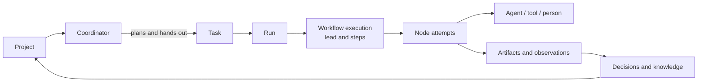
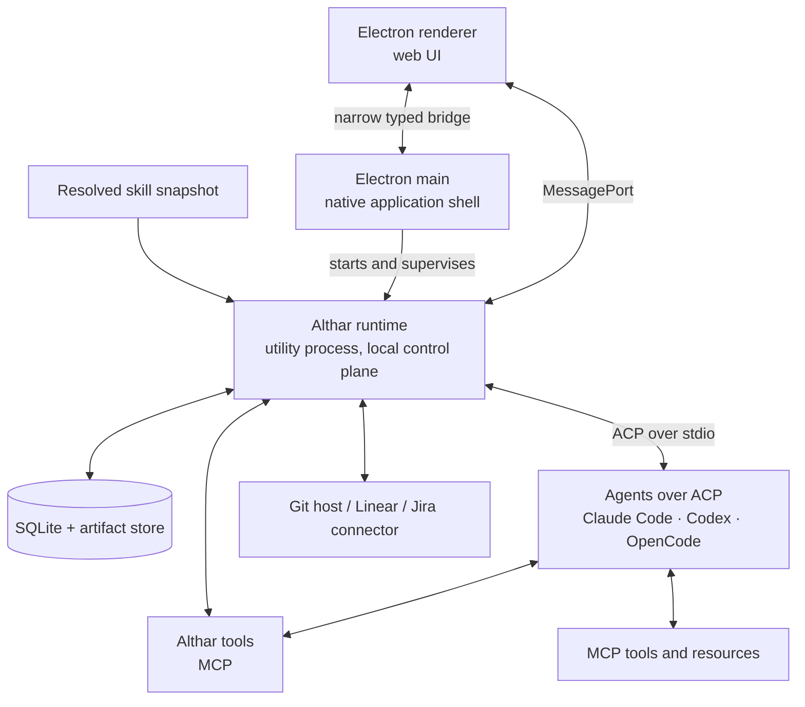

# Althar Architecture

> **Status:** Working architecture baseline
> **Date:** 2026-09-20, harness decisions added 2026-09-28
> **Scope:** Local-first MVP with explicit seams for later cloud authority
> **Audience:** Product engineers familiar with web or mobile development

## What Althar is

Althar is a durable coordination layer for engineering work.

It lets a person define work at the level of a project, connect the repositories
and external systems that work needs, delegate parts of it to coding agents, and
retain the resulting evidence, decisions, and useful knowledge after any
particular agent conversation has ended.

Althar is therefore an **agent harness**, but not a new agent runtime:

- Althar owns projects, tasks, workflow state, policy, approvals,
  integrations, skills, evidence, and recovery.
- Claude Code, Codex, OpenCode, or another agent owns its model calls, context
  window, native tool loop, provider conversation, and provider
  authentication. Althar reaches every agent through the Agent Client
  Protocol (ACP).
- Althar supervises and interprets provider work without trying to reproduce
  the provider internally.

This distinction is the architectural centre of the product. Existing coding
agents already solve model/tool interaction. Althar's reason to exist is the
durable layer above them.

## The product model

The main concepts form one chain:

In plain terms:

1. A **project** is the durable coordination space.
2. A project may refer to zero, one, or many repositories.
3. The project's **coordinator** is the agent you talk to. It plans work and
   hands it out as tasks, and never writes code itself.
4. A **task** describes desired work and the repositories or systems it may use.
5. Starting the task creates a **run**.
6. The run materializes a durable **workflow**: the task's **lead**, the agent
   that implements it, and **steps** such as review, run by other agents.
7. Workflow nodes ask an agent, tool, integration, or person to do something.
8. Althar records attempts, approvals, outputs, verification, and
   uncertainty.
9. Useful results become project evidence, decisions, or scoped knowledge.

These objects remain distinct because they have different lifetimes. A provider
conversation may disappear while the project, task, workflow history, and
evidence remain useful.

## What a project means

A project is not a folder, Git repository, checkout, team, or agent chat. It is
the durable place where related intent, work, policy, history, and context meet.

It may contain:

- no repository, for research or planning;
- one repository, for the common application case;
- several repositories, for work spanning frontend, backend, infrastructure,
  documentation, or shared libraries.

Repository identity is shared project metadata. A filesystem path and
credential belong to one device or runner. Consequently two collaborators can
refer to the same logical repository while mapping it to different local
clones.

Project is the first useful coordination boundary, not a claim that all
engineering knowledge must remain project-scoped forever. Knowledge may later
need task, repository, product, team, organization, or federated scope.

## A representative interaction

Consider a task that changes a web application and its API:

1. The user creates a project and selects two existing repositories.
2. Althar records two shared repository bindings and this computer's local
   paths separately.
3. The user creates a task that may write the frontend and read/write the API.
4. Althar prepares managed workspaces without changing either selected
   working copy.
5. A workflow invokes one coding-agent runtime with the required repositories,
   skills, tools, and policy.
6. The user interrupts the current turn with a new constraint.
7. Althar acknowledges the interruption, safely stops the active turn, and
   continues the unfinished task with the new message at the front of the
   queue.
8. The workflow verifies the resulting changes independently.
9. Althar retains repository-specific changes, verification evidence,
   decisions, and any promoted knowledge claim.

The provider session helped perform the work. It did not become the identity or
sole record of the work.

## The local application

The MVP is one installed product with a UI and a local backend:

For a web/mobile developer, the renderer is the frontend and the Althar
runtime is a backend service that happens to run on the same computer. Electron
main is the thin native shell between them.

The separate runtime, which runs in an Electron utility process:

- remains the only writer to the local database;
- owns long-running providers and tools;
- keeps filesystem, shell, and credentials out of the renderer;
- can reconcile work after a UI reload or runtime crash;
- provides one typed API to the desktop and a possible diagnostic CLI.

This is process separation, not microservices. There is one product, one local
authority, and one database.

## Architectural boundaries

Four concepts that may all look like “plugins” are intentionally separate:

| Boundary | Purpose | Example |
|---|---|---|
| Provider runtime adapter | Run an agent session | Claude Code, Codex, or OpenCode over ACP |
| Domain connector | Reconcile durable external state | Linear, Jira, GitHub |
| MCP connection | Expose callable tools/resources | Search or database tool |
| Skill package | Supply procedural knowledge/resources | Review or migration skill |

They have different authentication, failure, retry, permission, and persistence
semantics.

Workflow execution is another boundary. A workflow definition is immutable; a
run receives a revisioned execution graph. An agent may propose a bounded graph
change, but Althar validates and commits it. Agents do not rewrite completed
history or silently expand their authority.

## Reading order

The detailed documents build the architecture in the order a reader encounters
the concepts:

1. [Concepts and project model](01-concepts-and-project-model.md)
   explains projects, multi-repository identity, tasks, runs, workspaces,
   collaboration, chat queuing, and scope.

2. [Desktop application and local runtime](02-desktop-runtime.md)
   explains Electron's processes, the local-backend model, IPC, long-running
   child processes, shutdown, crashes, and code/package boundaries.

3. [Agent runtime and authentication](03-agent-runtime-and-auth.md)
   explains what Althar delegates to agents, ACP and its gaps, the agent
   registry, briefing agents, switching model or agent, usage limits,
   permission routing, process ownership, and authentication.

4. [Coordinator](04-coordinator.md)
   explains the project's coordinator: an agent session with Althar's tools
   and read-only access, whose conversation Althar keeps.

5. [Workflow engine](05-workflow-engine.md)
   explains durable graphs, node attempts, retries, dynamic changes,
   self-repair, compensation, interruption, task leads and steps, and workflow
   authoring.

6. [Integrations and skills](06-integrations-and-skills.md)
   explains Linear/Jira/Git hosting connectors, MCP, synchronization,
   credentials, skill resolution, and skill trust.

7. [Persistence, security, scale, and cloud](07-persistence-security-and-cloud.md)
   explains SQLite, artifacts, trust boundaries, performance constraints,
   local authority, and future collaboration/cloud ownership.

8. [Precedents and architecture validation](08-precedents-and-validation.md)
   compares relevant systems, records required architecture decisions, and
   states the evidence that would validate or invalidate the design.

Decisions are recorded one per file in [`docs/decisions/`](../decisions/). The
words the interface uses are in [the glossary](../glossary.md), and what is
still open is in [the open questions](../open-questions.md).

## System-wide invariants

These rules matter more than the eventual class or folder names:

1. One accepted writer advances an aggregate revision; retried commands are
   idempotent.
2. Task, run, workflow execution, node attempt, provider session, workspace,
   integration connection, and skill version are different identities.
3. Display states such as “working” and “needs you” are derived from durable
   facts.
4. A project may bind zero, one, or many repositories and survives changes to
   that set.
5. Shared repository identity never implies a shared path or credential.
6. One run attempt has one controller generation: an incrementing ownership
   token that prevents an older worker from writing after replacement.
7. Completed or running workflow nodes cannot be retroactively rewritten.
8. A graph change cannot broaden repositories, tools, credentials, external
   mutation rights, visibility, or budget without policy evaluation.
9. An approval binds an exact action digest, inputs, actor, policy, and expiry.
10. Provider authentication stays inside the provider's supported mechanism.
11. Skills add instructions and resources, never ambient authority.
12. MCP tool availability is distinct from permission to invoke it.
13. External systems remain authoritative for their own resources.
14. Login, linking, sharing, cloning, uploading, and cloud execution are
    separate user actions.
15. Every retry, loop, fan-out, repair, and background poll has a bound.
16. Interrupting a chat turn acknowledges and stops that turn, then continues
    the unfinished objective with the new input. It is not task cancellation.
17. Every session starts from a brief Althar assembled and recorded. No
    agent's own memory is the only record of a task.
18. Every permission request reaches Althar. No session starts in a bypass
    mode.
19. Switching model or agent never loses the task's workspace or record.

## MVP architecture boundary

The local MVP includes:

- one local profile and no mandatory account;
- projects with zero or more repository bindings;
- several explicitly selected local clones or Git URLs;
- a git worktree per task that does not mutate selected working copies;
- one host satisfying each run's full repository and credential set;
- one ACP adapter serving Claude Code, Codex, and OpenCode, with native side
  channels where ACP falls short;
- switching model or agent mid-task;
- a coordinator per project: a read-only agent session with Althar's tools;
- one immutable, code-owned workflow with attention and verification;
- durable chat input with interrupt-and-continue behavior;
- persisted attempts, observations, approvals, artifacts, changes, and claims;
- trusted skills resolved into a frozen run snapshot;
- restart reconciliation, diagnostics, backup, and restore.

It does not require:

- a home-grown model/tool loop;
- converting one agent's session files into another's format;
- a provider marketplace;
- a visual workflow builder;
- arbitrary agent-authored executable nodes;
- automatic cross-device source cloning;
- both Linear and Jira;
- cloud custody of subscription CLI credentials;
- multi-host execution within one run;
- CRDT-based collaboration;
- distributed event sourcing;
- a general-purpose secret manager;
- claims that host-native execution is sandboxed.

The architecture retains seams for these capabilities without making them
present-tense product promises. The current plan for the first demo, which is
temporary, is in [docs/plans/mvp.md](../plans/mvp.md).

## Building to standard

The proof of concept is built to product standard, so it can become the
product without a rewrite. Shortcuts are allowed in behaviour, never in
recorded facts or data shapes
([ADR-008](../decisions/008-shortcuts-in-behaviour-not-in-records.md)). If the
facts are recorded, smarter behaviour is a later change. If they are missing,
the history cannot be recovered.

## Product choices

Decided:

| Choice | Decision | Record |
|---|---|---|
| Agent protocol | ACP for every agent, behind Althar's adapter port, with native side channels and replacement adapters where ACP falls short | [ADR-002](../decisions/002-acp-for-every-agent.md) |
| Agents in the MVP | Claude Code, Codex, and OpenCode, interchangeable | [ADR-002](../decisions/002-acp-for-every-agent.md) |
| Shell | Electron, with the runtime in a utility process | [ADR-003](../decisions/003-electron-shell.md) |
| Coordinator | An ordinary agent session with Althar's tools and read-only access | [ADR-004](../decisions/004-coordinator-is-an-agent-session.md) |
| Starting context | Althar briefs every agent; switching agent hands over everything in the MVP | [ADR-005](../decisions/005-althar-briefs-every-agent.md) |
| Workspaces | A git worktree per task, in `~/Althar/<project>/<task>/<repository>`; plain branches maybe later | [ADR-006](../decisions/006-worktree-per-task.md) |
| Permissions | Every request reaches Althar and is answered from the project rules | [ADR-007](../decisions/007-permission-requests-reach-althar.md) |
| Build standard | Shortcuts in behaviour, never in recorded facts or data shapes | [ADR-008](../decisions/008-shortcuts-in-behaviour-not-in-records.md) |
| Runtime-side code | Effect 4, pinned; never in the UI kit | [ADR-009](../decisions/009-effect-on-the-runtime-side.md) |
| Desktop app | MVVM: views, hooks as view models, an Effect data layer; feature folders; TanStack Router | [ADR-010](../decisions/010-desktop-app-mvvm.md) |

Still requiring sign-off. The architecture uses these recommended defaults:

| Choice | Recommended default | Why it matters |
|---|---|---|
| Subscription-backed CLI auth | Local execution through the official CLI only | Cloud must not extract or relay consumer subscription credentials |
| First issue tracker | Choose Linear or Jira from the first serious cohort | Building both obscures field ownership and reconciliation lessons |
| MCP posture | Althar broker with explicit grants and audit | Provider-native pass-through is less consistently observable |
| Workflow authoring | Inspectable code-owned definitions; declarative/visual authoring is not assumed | Prevents an editor from preceding trustworthy execution semantics |
| Dynamic repair | Bounded graph-patch proposals plus human escalation | Unrestricted replanning is not replayable or safely resumable |
| Skill format | Agent Skills-compatible `SKILL.md` packages | Avoids an Althar-only ecosystem |
| Critical skill activation | Explicit version pins in the run snapshot | Silent latest-version resolution makes runs irreproducible |
| Repository-free projects | Allowed | Supports research while keeping project independent of source topology |
| Multi-host run | Excluded from the local architecture | Requires distributed leases, transfer, cancellation, and partial-failure rules |
| Local external refresh | Cursor-based pull/on-demand refresh; no hidden public tunnel | Reliable webhooks require explicit cloud ingress |

## Primary references

- [Agent Client Protocol](https://agentclientprotocol.com/)
- [Codex app-server](https://learn.chatgpt.com/docs/app-server)
- [Codex authentication](https://learn.chatgpt.com/docs/auth)
- [Building Codex skills](https://learn.chatgpt.com/docs/build-skills)
- [OpenCode ACP support](https://opencode.ai/docs/acp/)
- [Model Context Protocol](https://modelcontextprotocol.io/)
- [Agent Skills specification](https://agentskills.io/specification)
- [LangGraph durable execution](https://docs.langchain.com/oss/javascript/langgraph/thinking-in-langgraph)
- [Temporal workflows](https://docs.temporal.io/workflow-definition)
