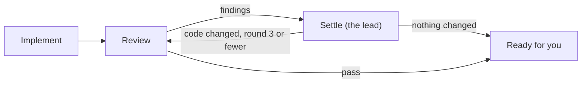

# MVP plan

> **Temporary.** This is the plan for the first demo, not architecture. When
> the demo ships, delete this file, and move anything that lasted into the
> architecture docs.

## Goal

The demo, end to end in the desktop app:

1. Open a folder as a project.
2. Ask the coordinator for a change. It drafts a task and a plan.
3. After the countdown, a Claude Code lead implements it, and Codex reviews.
4. The lead settles the findings.
5. Partway through, you switch the lead to OpenCode, which carries on in the
   same worktree.
6. It ends with a draft PR.

Simple as it is, it is built to the product standard
([ADR-008](../decisions/008-shortcuts-in-behaviour-not-in-records.md)).

## The plan

Decided with the user on 30 September 2026.

A task's plan is a short list of steps that the coordinator composes from a
small catalogue, as close to the end product as the demo gets. Each step type
owns its own loop. There is no planning step: the lead works out how to do
the task itself. For now the catalogue has two:

| Step | Who | What it does |
|---|---|---|
| Implement | The lead | Does the task as it sees fit, then ends the step by reporting to Charrette through its tool, with a summary |
| Review | Another agent | Read-only. By default on another provider's strongest model. Returns a verdict and findings. The lead settles them in its own session. Up to 3 rounds |

- **A plan doesn't change once it runs,** for now. The engine's graph patches
  come later.
- **Verify is out.** A step that runs the checks would rebuild CI. Manual QA
  will be a step of its own later.
- **Draft PR comes later.** For now a task ends ready for you, on its branch.
- The steps run on the real kernel: graph revisions, node attempts, the
  bounded loop, and fencing. Patches, fan-out and compensation are in the
  schema but not executed.

How steps behave in general (the lead's session, the review loop, read-only
reviewers, the default reviewer) is architecture, in
[05](../architecture/05-workflow-engine.md).

## The coordinator loop

1. You talk to the coordinator in the project's Talk room. It answers
   questions itself; only changes become tasks.
2. It drafts a task and its plan: the steps, an agent for each, and why it
   chose the lead.
3. The launch card shows the plan with a 25-second countdown, which the
   runtime owns, so the plan starts even with the window closed. You can
   change an agent, skip Review, hold it, or start it now.
4. The task's card in the Talk room follows it as its status changes.
5. A task you start by hand shows up in the Talk room the same way, as its
   card.

- **The coordinator's agent** is whatever you last used: the agent and model
  it last ran on in this project, or for a new project the one you last used
  anywhere. If that agent isn't signed in, the Talk room says so and offers
  the ones that are.
- **Work is collapsed.** Once a turn is over, its tool calls and messages
  fold under one "Worked for" line, with the summary the agent reported
  under it. What stays open is what needs you.

## For now

- **Always ask:** pushes to the default branch, force pushes, merges, deploy
  commands, and writes outside the task's worktree. Everything else is
  allowed and recorded.
- **Permissions** are answered by the rules alone. The lead doesn't answer
  yet.
- **Draft PR** at the end of every task, once it exists. Marking it ready and
  merging stay with you.
- **Budgets** start generous and are recorded on every run: a timeout per node
  and a cost ceiling per task.
- **One device, no cloud, macOS first.**

## Build order

1. **The agent harness, without a UI.** A runtime and a command-line client:
   - sessions on Claude Code, Codex, and OpenCode over ACP, each task in a
     worktree;
   - permissions answered from the rules;
   - interrupt-and-continue, and switching model or agent;
   - usage-limit detection;
   - everything recorded in SQLite.

   It starts with the schema and the event log.
2. **The desktop shell.** Electron, with the runtime in a utility process, and
   the UI kit showing a real thread. Built (`apps/desktop`): projects, tasks,
   a task's thread with its calls, and the lead's controls.
3. **The coordinator,** and the demo above.

## Done when

- The demo above runs.
- The contract suite passes on Claude Code, Codex, and OpenCode.
- A restart in the middle of a turn is detected, and nothing runs twice.
