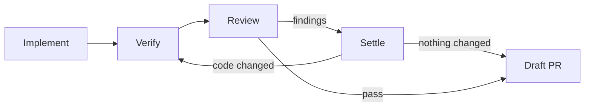

# MVP plan

> **Temporary.** This is the plan for the first demo, not architecture. When
> the demo ships, delete this file, and move anything that lasted into the
> architecture docs.

## Goal

The demo, end to end in the desktop app:

1. Open a folder as a project.
2. Ask the coordinator for a change. It drafts a task and a plan.
3. After the countdown, a Claude Code lead implements it, and Codex reviews.
4. The lead settles the findings.
5. Partway through, you switch the lead to OpenCode, which carries on in the
   same worktree.
6. It ends with a draft PR.

Simple as it is, it is built to the product standard
([ADR-008](../decisions/008-shortcuts-in-behaviour-not-in-records.md)).

## The fixed graph

Every task runs the same graph. The coordinator fills in its choices (the lead,
the reviewer, whether Review runs) and does not compose other shapes yet.
Composing a graph per task is the next demo.

| Node | Type | Who |
|---|---|---|
| Implement | Agent | The lead |
| Verify | Verification | Charrette runs the project's check command |
| Review | Agent | The reviewer |
| Settle | Agent | The lead, in the same session as Implement |
| Draft PR | Integration | Charrette pushes the task branch and opens a draft PR with `gh` |

How these steps behave in general (the lead's session, Verify, the review loop,
read-only reviewers, the default reviewer) is architecture, in
[05](../architecture/05-workflow-engine.md).

The graph runs on the real kernel: definitions, graph revisions, node
attempts, joins, the bounded loop, and fencing. Graph patches, fan-out, and
compensation are in the schema but not executed.

## For now

- **Always ask:** pushes to the default branch, force pushes, merges, deploy
  commands, and writes outside the task's worktree. Everything else is
  allowed and recorded.
- **Permissions** are answered by the rules alone. The lead doesn't answer
  yet.
- **Draft PR** at the end of every task. Marking it ready and merging stay
  with you.
- **Budgets** start generous and are recorded on every run: a timeout per node
  and a cost ceiling per task.
- **One device, no cloud, macOS first.**

## Build order

1. **The agent harness, without a UI.** A runtime and a command-line client:
   - sessions on Claude Code, Codex, and OpenCode over ACP, each task in a
     worktree;
   - permissions answered from the rules;
   - interrupt-and-continue, and switching model or agent;
   - usage-limit detection;
   - everything recorded in SQLite.

   It starts with the schema and the event log.
2. **The desktop shell.** Electron, with the runtime in a utility process, and
   the UI kit showing a real thread.
3. **The coordinator,** and the demo above.

## Done when

- The demo above runs.
- The contract suite passes on Claude Code, Codex, and OpenCode.
- A restart in the middle of a turn is detected, and nothing runs twice.
